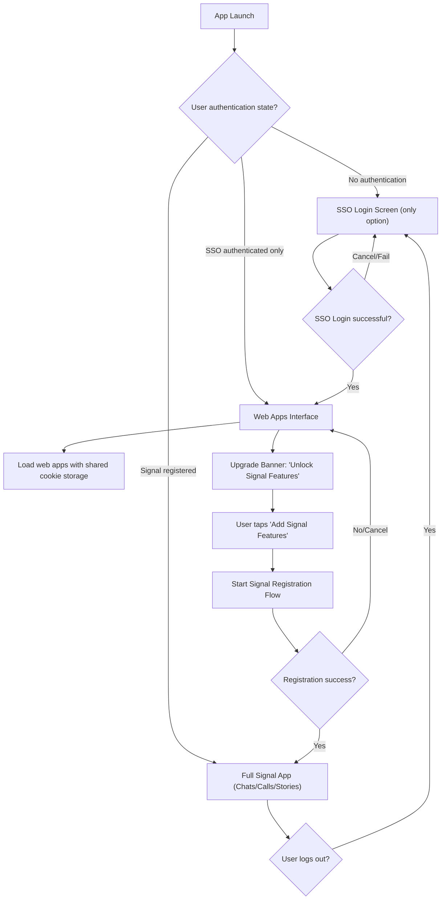

## Integration: Progressive registration from SSO to full Signal

⚠️ **IMPORTANT: This plan has been split into 3 manageable phases for AI implementation**

**See the following files for implementation:**

- 📋 **PHASE_1_MVP.md** - AI-implementable core features (2-3 sessions)
- 🔧 **PHASE_2_INTEGRATION.md** - Real SSO integration & polish (AI-assisted)
- 🚀 **PHASE_3_ADVANCED.md** - Production features (manual implementation)

---

Replace the registration flow with a progressive system. Users start with SSO authentication for web app access, then can gradually unlock full Signal features (messaging, calls, stories) through an optional upgrade flow. All web apps share cookie storage for authentication consistency.

### Flow



### Key touchpoints

- `Signal/AppLaunch/AppDelegate.swift`: detect authentication state and route to appropriate UI (login/web apps/full Signal).
- `Signal/AppLaunch/SignalApp.swift`: handle different app states and root view controller building.
- `Signal/src/ViewControllers/SSO/SsoWebAppViewController.swift`: web apps interface with upgrade promotion banner.
- `Signal/src/ViewControllers/SSO/SsoSharedWebView.swift`: manage shared cookie storage for SSO consistency.
- `Signal/src/Models/AppAuthenticationState.swift`: state machine for authentication levels.
- `Signal/src/Utilities/UpgradeBannerManager.swift`: manage upgrade prompts and error toasts.

---

## Step 1: Add Authentication State Machine

Create `Signal/src/Models/AppAuthenticationState.swift`:

```swift
import Foundation
import SignalServiceKit

enum AppAuthenticationState {
    case noAuthentication
    case ssoOnly
    case signalRegistered

    var description: String {
        switch self {
        case .noAuthentication: return "No authentication"
        case .ssoOnly: return "SSO authenticated only"
        case .signalRegistered: return "Full Signal registration"
        }
    }
}

final class AppAuthenticationStateManager {
    static let shared = AppAuthenticationStateManager()

    private init() {}

    var currentState: AppAuthenticationState {
        let isSignalRegistered = DependenciesBridge.shared.tsAccountManager
            .registrationStateWithMaybeSneakyTransaction.isRegistered

        if isSignalRegistered {
            return .signalRegistered
        }

        let isSsoAuthenticated = SsoAuthenticationManager.shared.isAuthenticated
        if isSsoAuthenticated {
            return .ssoOnly
        }

        return .noAuthentication
    }

    func canTransition(to newState: AppAuthenticationState) -> Bool {
        switch (currentState, newState) {
        case (.noAuthentication, .ssoOnly),
             (.ssoOnly, .signalRegistered),
             (.signalRegistered, .noAuthentication), // logout
             (.ssoOnly, .noAuthentication): // logout
            return true
        default:
            return false
        }
    }
}
```

---

## Step 2: Add Web Apps View Controller

Create `Signal/src/ViewControllers/SSO/SsoWebAppViewController.swift`:

```swift
import UIKit
import SignalServiceKit

final class SsoTabBarController: UITabBarController {
    private let appReadiness: AppReadinessSetter
    private let ssoSharedWebView: SsoSharedWebView

    init(appReadiness: AppReadinessSetter) {
        self.appReadiness = appReadiness
        self.ssoSharedWebView = SsoSharedWebView()
        super.init(nibName: nil, bundle: nil)
    }
    required init?(coder: NSCoder) { fatalError("init(coder:) has not been implemented") }

    override func viewDidLoad() {
        super.viewDidLoad()
        setupTabs()

        // Listen for Signal registration completion
        NotificationCenter.default.addObserver(
            self,
            selector: #selector(registrationStateDidChange),
            name: .registrationStateDidChange,
            object: nil
        )
    }

    private func setupTabs() {
        let webAppsVC = SsoWebAppViewController(sharedWebView: ssoSharedWebView)
        webAppsVC.tabBarItem = UITabBarItem(
            title: OWSLocalizedString("SSO_WEB_APPS_TAB", comment: "Web Apps tab title"),
            image: UIImage(systemName: "safari"),
            tag: 0
        )

        let signupPromotionVC = SignalSignupPromotionViewController(appReadiness: appReadiness)
        signupPromotionVC.tabBarItem = UITabBarItem(
            title: OWSLocalizedString("SSO_GET_SIGNAL_TAB", comment: "Get Signal tab title"),
            image: UIImage(systemName: "message"),
            tag: 1
        )

        viewControllers = [
            UINavigationController(rootViewController: webAppsVC),
            UINavigationController(rootViewController: signupPromotionVC)
        ]
    }

    @objc private func registrationStateDidChange() {
        guard DependenciesBridge.shared.tsAccountManager.registrationStateWithMaybeSneakyTransaction.isRegistered else { return }
        // User completed Signal registration - transition to full app
        SignalApp.shared.showMainUI()
    }
}
```

---

## Step 2: Add Web Apps Tab Controller

Create `Signal/src/ViewControllers/SSO/SsoWebAppViewController.swift`:

```swift
import UIKit
import SignalServiceKit
import WebKit

final class SsoWebAppViewController: UIViewController {
    private let webView: WKWebView
    private let upgradeBannerManager: UpgradeBannerManager
    private var upgradeBanner: UIView?

    init() {
        // Use shared cookie storage configuration
        let config = WKWebViewConfiguration()
        config.processPool = SsoSharedWebView.sharedProcessPool
        config.websiteDataStore = WKWebsiteDataStore.default()

        self.webView = WKWebView(frame: .zero, configuration: config)
        self.upgradeBannerManager = UpgradeBannerManager()
        super.init(nibName: nil, bundle: nil)
    }
    required init?(coder: NSCoder) { fatalError("init(coder:) has not been implemented") }

    override func viewDidLoad() {
        super.viewDidLoad()
        view.backgroundColor = Theme.viewBackgroundColor
        title = OWSLocalizedString("SSO_WEB_APPS_TITLE", comment: "Web Apps screen title")

        setupWebView()
        setupUpgradeBanner()
        loadDefaultWebApp()
    }

    private func setupWebView() {
        webView.translatesAutoresizingMaskIntoConstraints = false
        view.addSubview(webView)

        // We'll update constraints after adding upgrade banner
    }

    private func setupUpgradeBanner() {
        upgradeBanner = upgradeBannerManager.createUpgradeBanner { [weak self] in
            self?.startSignalRegistration()
        }

        if let banner = upgradeBanner {
            view.addSubview(banner)

            NSLayoutConstraint.activate([
                banner.topAnchor.constraint(equalTo: view.safeAreaLayoutGuide.topAnchor),
                banner.leadingAnchor.constraint(equalTo: view.leadingAnchor),
                banner.trailingAnchor.constraint(equalTo: view.trailingAnchor),
                banner.heightAnchor.constraint(equalToConstant: 60),

                webView.topAnchor.constraint(equalTo: banner.bottomAnchor),
                webView.leadingAnchor.constraint(equalTo: view.leadingAnchor),
                webView.trailingAnchor.constraint(equalTo: view.trailingAnchor),
                webView.bottomAnchor.constraint(equalTo: view.bottomAnchor)
            ])
        }
    }

    private func loadDefaultWebApp() {
        if let defaultURL = URL(string: "https://your-default-webapp.com") {
            webView.load(URLRequest(url: defaultURL))
        }
    }

    private func startSignalRegistration() {
        let loader = RegistrationCoordinatorLoaderImpl(dependencies: .from(self))
        SignalApp.shared.showRegistration(loader: loader, desiredMode: .registering, appReadiness: AppReadiness.shared)
    }
}
```

---

## Step 3: Add Upgrade Banner Manager

Create `Signal/src/Utilities/UpgradeBannerManager.swift`:

```swift
import UIKit
import SignalServiceKit

final class UpgradeBannerManager {
    private var currentToast: UIView?

    func createUpgradeBanner(onTap: @escaping () -> Void) -> UIView {
        let container = UIView()
        container.backgroundColor = .signalBlue
        container.translatesAutoresizingMaskIntoConstraints = false

        let iconImageView = UIImageView(image: UIImage(systemName: "message.badge"))
        iconImageView.tintColor = .white
        iconImageView.translatesAutoresizingMaskIntoConstraints = false

        let titleLabel = UILabel()
        titleLabel.text = OWSLocalizedString("SSO_UPGRADE_BANNER_TITLE", comment: "Upgrade banner title")
        titleLabel.font = UIFont.preferredFont(forTextStyle: .headline)
        titleLabel.textColor = .white
        titleLabel.translatesAutoresizingMaskIntoConstraints = false

        let subtitleLabel = UILabel()
        subtitleLabel.text = OWSLocalizedString("SSO_UPGRADE_BANNER_SUBTITLE", comment: "Upgrade banner subtitle")
        subtitleLabel.font = UIFont.preferredFont(forTextStyle: .caption1)
        subtitleLabel.textColor = .white.withAlphaComponent(0.8)
        subtitleLabel.translatesAutoresizingMaskIntoConstraints = false

        let upgradeButton = UIButton(type: .system)
        upgradeButton.setTitle(OWSLocalizedString("SSO_UPGRADE_BUTTON", comment: "Add Signal Features button"), for: .normal)
        upgradeButton.setTitleColor(.white, for: .normal)
        upgradeButton.titleLabel?.font = UIFont.preferredFont(forTextStyle: .subheadline).semibold()
        upgradeButton.layer.borderColor = UIColor.white.cgColor
        upgradeButton.layer.borderWidth = 1
        upgradeButton.layer.cornerRadius = 6
        upgradeButton.translatesAutoresizingMaskIntoConstraints = false
        upgradeButton.addTarget(self, action: #selector(upgradeButtonTapped), for: .touchUpInside)

        // Store the tap action
        upgradeButton.accessibilityHint = "upgrade_action"
        objc_setAssociatedObject(upgradeButton, "tapAction", onTap, .OBJC_ASSOCIATION_RETAIN_NONATOMIC)

        let textStack = UIStackView(arrangedSubviews: [titleLabel, subtitleLabel])
        textStack.axis = .vertical
        textStack.spacing = 2
        textStack.translatesAutoresizingMaskIntoConstraints = false

        container.addSubview(iconImageView)
        container.addSubview(textStack)
        container.addSubview(upgradeButton)

        NSLayoutConstraint.activate([
            iconImageView.leadingAnchor.constraint(equalTo: container.leadingAnchor, constant: 16),
            iconImageView.centerYAnchor.constraint(equalTo: container.centerYAnchor),
            iconImageView.widthAnchor.constraint(equalToConstant: 24),
            iconImageView.heightAnchor.constraint(equalToConstant: 24),

            textStack.leadingAnchor.constraint(equalTo: iconImageView.trailingAnchor, constant: 12),
            textStack.centerYAnchor.constraint(equalTo: container.centerYAnchor),

            upgradeButton.trailingAnchor.constraint(equalTo: container.trailingAnchor, constant: -16),
            upgradeButton.centerYAnchor.constraint(equalTo: container.centerYAnchor),
            upgradeButton.widthAnchor.constraint(equalToConstant: 100),
            upgradeButton.heightAnchor.constraint(equalToConstant: 32),

            textStack.trailingAnchor.constraint(lessThanOrEqualTo: upgradeButton.leadingAnchor, constant: -12)
        ])

        return container
    }

    @objc private func upgradeButtonTapped(_ sender: UIButton) {
        if let tapAction = objc_getAssociatedObject(sender, "tapAction") as? () -> Void {
            tapAction()
        }
    }

    func showErrorToast(message: String, in parentView: UIView) {
        // Dismiss any existing toast
        dismissCurrentToast()

        let toast = createToast(message: message, isError: true)
        currentToast = toast

        parentView.addSubview(toast)

        NSLayoutConstraint.activate([
            toast.leadingAnchor.constraint(equalTo: parentView.leadingAnchor, constant: 16),
            toast.trailingAnchor.constraint(equalTo: parentView.trailingAnchor, constant: -16),
            toast.bottomAnchor.constraint(equalTo: parentView.safeAreaLayoutGuide.bottomAnchor, constant: -16)
        ])

        // Animate in
        toast.transform = CGAffineTransform(translationX: 0, y: 100)
        UIView.animate(withDuration: 0.3, delay: 0, options: .curveEaseOut) {
            toast.transform = .identity
        }

        // Auto-dismiss after 4 seconds
        DispatchQueue.main.asyncAfter(deadline: .now() + 4) { [weak self] in
            self?.dismissCurrentToast()
        }
    }

    private func createToast(message: String, isError: Bool) -> UIView {
        let container = UIView()
        container.backgroundColor = isError ? .systemRed : .systemGreen
        container.layer.cornerRadius = 8
        container.translatesAutoresizingMaskIntoConstraints = false

        let label = UILabel()
        label.text = message
        label.textColor = .white
        label.font = UIFont.preferredFont(forTextStyle: .subheadline)
        label.numberOfLines = 0
        label.translatesAutoresizingMaskIntoConstraints = false

        container.addSubview(label)

        NSLayoutConstraint.activate([
            label.leadingAnchor.constraint(equalTo: container.leadingAnchor, constant: 16),
            label.trailingAnchor.constraint(equalTo: container.trailingAnchor, constant: -16),
            label.topAnchor.constraint(equalTo: container.topAnchor, constant: 12),
            label.bottomAnchor.constraint(equalTo: container.bottomAnchor, constant: -12)
        ])

        return container
    }

    private func dismissCurrentToast() {
        guard let toast = currentToast else { return }

        UIView.animate(withDuration: 0.3, delay: 0, options: .curveEaseIn) {
            toast.transform = CGAffineTransform(translationX: 0, y: 100)
            toast.alpha = 0
        } completion: { _ in
            toast.removeFromSuperview()
        }

        currentToast = nil
    }
}
```

---

## Step 4: Update App Launch Logic

Modify `Signal/AppLaunch/AppDelegate.swift` to handle the new authentication states:

```swift
private func determineAppMode() -> AppMode {
    let currentState = AppAuthenticationStateManager.shared.currentState

    switch currentState {
    case .signalRegistered:
        return .chatList // Full Signal app with chats/calls/stories
    case .ssoOnly:
        return .webApps // Web apps interface with upgrade banner
    case .noAuthentication:
        return .ssoLogin // Show SSO login screen (only authentication option)
    }
}

// Update launch routing:
case .unregistered:
    let appMode = determineAppMode()
    switch appMode {
    case .chatList:
        return .chatList
    case .webApps:
        return .webApps(SsoWebAppViewController())
    case .ssoLogin:
        if UIDevice.current.isIPad {
            return .secondaryProvisioning // Keep iPad linking for now
        } else {
            return .ssoLogin(SsoLoginViewController()) // SSO-only login
        }
    }
```

---

## Step 5: Enhance Shared WebView for SSO Cookie Management

Update the existing `SsoSharedWebView.swift` to use shared cookie storage:

```swift
// Update existing SsoSharedWebView implementation
extension SsoSharedWebView {
    static let sharedProcessPool = WKProcessPool()

    private static func createSharedConfiguration() -> WKWebViewConfiguration {
        let config = WKWebViewConfiguration()
        config.processPool = sharedProcessPool
        config.websiteDataStore = WKWebsiteDataStore.default()

        // Add any additional security configurations
        config.preferences.javaScriptEnabled = true
        config.preferences.javaScriptCanOpenWindowsAutomatically = false

        return config
    }

    // Factory method for creating webviews with shared cookies
    static func createWebView() -> WKWebView {
        return WKWebView(frame: .zero, configuration: createSharedConfiguration())
    }

    func loadWebApp(url: URL) {
        // Load web app while preserving SSO session
        load(URLRequest(url: url))
    }

    func clearSSOSession() {
        // Clear cookies when user logs out
        let dataStore = WKWebsiteDataStore.default()
        let types = Set([WKWebsiteDataTypeCookies, WKWebsiteDataTypeSessionStorage])

        dataStore.removeData(ofTypes: types, modifiedSince: Date.distantPast) { [weak self] in
            DispatchQueue.main.async {
                // Optional: reload to reflect logged-out state
                self?.reload()
            }
        }
    }
}
```

---

## Step 6: Add Required Localized Strings

Add the following strings to support the new progressive registration system:

```
// Web Apps Interface
"SSO_WEB_APPS_TITLE" = "Web Apps";

// Upgrade Banner
"SSO_UPGRADE_BANNER_TITLE" = "Add Signal Features";
"SSO_UPGRADE_BANNER_SUBTITLE" = "Unlock messaging, calls & stories";
"SSO_UPGRADE_BUTTON" = "Add Features";

// Authentication States
"SSO_LOGIN_TITLE" = "Sign In";
"SSO_LOGIN_SUBTITLE" = "Use your organization credentials to access web apps";
"SSO_LOGIN_BUTTON" = "Sign in with SSO";

// Error Messages
"SSO_REGISTRATION_FAILED" = "Signal registration failed. Please try again.";
"SSO_NETWORK_ERROR" = "Network error. Please check your connection.";
"SSO_AUTH_EXPIRED" = "Your session has expired. Please sign in again.";
```

---

## Step 7: Security Implementation

Create `Signal/src/Security/SsoSecurityManager.swift`:

```swift
import Foundation
import Security
import CryptoKit

final class SsoSecurityManager {
    static let shared = SsoSecurityManager()
    private let keychain = SsoKeychainManager()
    private let allowedDomains = ["your-sso-domain.com", "your-webapp-domain.com"]

    private init() {}

    func refreshTokenIfNeeded() async throws {
        guard let currentToken = keychain.retrieveToken(),
              isTokenExpiring(currentToken) else { return }

        let newToken = try await requestTokenRefresh()
        keychain.storeToken(newToken)
    }

    func validateCSP(for webView: WKWebView) {
        let cspScript = """
            if (!document.querySelector('meta[http-equiv="Content-Security-Policy"]')) {
                const meta = document.createElement('meta');
                meta.httpEquiv = 'Content-Security-Policy';
                meta.content = "default-src 'self' \(allowedDomains.joined(separator: " ")); script-src 'self' 'unsafe-inline'";
                document.head.appendChild(meta);
            }
        """
        webView.evaluateJavaScript(cspScript, completionHandler: nil)
    }

    func setupSSLPinning() {
        // Configure SSL pinning for SSO endpoints
        URLSessionConfiguration.default.urlSessionDidReceiveChallenge = { session, challenge in
            return self.validateCertificate(challenge)
        }
    }

    func validateURL(_ url: URL) -> Bool {
        guard url.scheme == "https" else { return false }
        guard let host = url.host else { return false }
        return allowedDomains.contains(host)
    }

    private func validateCertificate(_ challenge: URLAuthenticationChallenge) -> (URLSession.AuthChallengeDisposition, URLCredential?) {
        // Implement certificate pinning validation
        guard let serverTrust = challenge.protectionSpace.serverTrust else {
            return (.cancelAuthenticationChallenge, nil)
        }

        // Add your certificate validation logic here
        return (.useCredential, URLCredential(trust: serverTrust))
    }

    private func isTokenExpiring(_ token: String) -> Bool {
        // Check if token expires within 5 minutes
        // Implementation depends on your token format
        return false
    }

    private func requestTokenRefresh() async throws -> String {
        // Implement token refresh with your SSO provider
        throw SsoError.refreshNotImplemented
    }
}

final class SsoKeychainManager {
    private let tokenKey = "sso_auth_token"

    func storeToken(_ token: String) {
        let data = Data(token.utf8)
        let query: [String: Any] = [
            kSecClass as String: kSecClassGenericPassword,
            kSecAttrAccount as String: tokenKey,
            kSecValueData as String: data
        ]

        SecItemDelete(query as CFDictionary)
        SecItemAdd(query as CFDictionary, nil)
    }

    func retrieveToken() -> String? {
        let query: [String: Any] = [
            kSecClass as String: kSecClassGenericPassword,
            kSecAttrAccount as String: tokenKey,
            kSecReturnData as String: true
        ]

        var result: AnyObject?
        let status = SecItemCopyMatching(query as CFDictionary, &result)

        guard status == errSecSuccess,
              let data = result as? Data else { return nil }

        return String(data: data, encoding: .utf8)
    }

    func deleteToken() {
        let query: [String: Any] = [
            kSecClass as String: kSecClassGenericPassword,
            kSecAttrAccount as String: tokenKey
        ]
        SecItemDelete(query as CFDictionary)
    }
}

enum SsoError: Error {
    case refreshNotImplemented
    case invalidToken
    case networkError
}
```

---

## Step 8: Missing Components Implementation

Create `Signal/src/SSO/SsoAuthenticationManager.swift`:

```swift
import Foundation
import SignalServiceKit

final class SsoAuthenticationManager {
    static let shared = SsoAuthenticationManager()

    private var authState: SsoAuthState = .unauthenticated
    private let securityManager = SsoSecurityManager.shared
    private let analytics = RegistrationAnalytics.shared

    private init() {
        loadPersistedAuthState()
    }

    var isAuthenticated: Bool {
        switch authState {
        case .authenticated: return true
        case .unauthenticated, .expired: return false
        }
    }

    func authenticate(with credentials: SsoCredentials) async throws {
        analytics.trackSsoLoginAttempt()

        do {
            let token = try await performAuthentication(credentials)
            authState = .authenticated(token: token, expiresAt: Date().addingTimeInterval(3600))
            persistAuthState()
            analytics.trackSsoLoginSuccess()
        } catch {
            analytics.trackSsoLoginFailure(error)
            throw error
        }
    }

    func validateSession() async -> Bool {
        guard case .authenticated(let token, let expiresAt) = authState else {
            return false
        }

        if Date() > expiresAt {
            authState = .expired
            return false
        }

        do {
            try await securityManager.refreshTokenIfNeeded()
            return true
        } catch {
            authState = .expired
            return false
        }
    }

    func logout() {
        authState = .unauthenticated
        securityManager.deleteToken()
        persistAuthState()
        analytics.trackSsoLogout()
    }

    private func performAuthentication(_ credentials: SsoCredentials) async throws -> String {
        // Implement your SSO authentication flow
        // This is a placeholder - replace with actual SSO implementation
        throw SsoError.networkError
    }

    private func loadPersistedAuthState() {
        if let token = securityManager.retrieveToken() {
            // Validate existing token
            authState = .authenticated(token: token, expiresAt: Date().addingTimeInterval(3600))
        }
    }

    private func persistAuthState() {
        switch authState {
        case .authenticated(let token, _):
            securityManager.storeToken(token)
        case .unauthenticated, .expired:
            securityManager.deleteToken()
        }
    }
}

enum SsoAuthState {
    case unauthenticated
    case authenticated(token: String, expiresAt: Date)
    case expired
}

struct SsoCredentials {
    let username: String
    let password: String
    // Add other fields as needed for your SSO provider
}

final class RegistrationAnalytics {
    static let shared = RegistrationAnalytics()
    private init() {}

    func trackSsoLoginAttempt() {
        // Integrate with your analytics system
        logEvent("sso_login_attempt")
    }

    func trackSsoLoginSuccess() {
        logEvent("sso_login_success")
    }

    func trackSsoLoginFailure(_ error: Error) {
        logEvent("sso_login_failure", parameters: ["error": error.localizedDescription])
    }

    func trackSsoLogout() {
        logEvent("sso_logout")
    }

    func trackUpgradeBannerShown() {
        logEvent("upgrade_banner_shown")
    }

    func trackUpgradeBannerTapped() {
        logEvent("upgrade_banner_tapped")
    }

    func trackRegistrationStarted() {
        logEvent("signal_registration_started")
    }

    func trackRegistrationCompleted() {
        logEvent("signal_registration_completed")
    }

    func trackRegistrationFailed(_ error: Error) {
        logEvent("signal_registration_failed", parameters: ["error": error.localizedDescription])
    }

    private func logEvent(_ name: String, parameters: [String: Any] = [:]) {
        // Replace with your actual analytics implementation
        // For example: Firebase, Amplitude, or Signal's existing analytics
        print("Analytics: \(name) - \(parameters)")
    }
}
```

Create `Signal/src/Navigation/DeepLinkRouter.swift`:

```swift
import UIKit
import SignalServiceKit

final class DeepLinkRouter {
    static let shared = DeepLinkRouter()
    private init() {}

    func route(_ url: URL) -> Bool {
        let authState = AppAuthenticationStateManager.shared.currentState

        guard SsoSecurityManager.shared.validateURL(url) else {
            return false
        }

        switch authState {
        case .noAuthentication:
            // Store deep link and redirect to login
            storeDeepLinkForLater(url)
            return false

        case .ssoOnly:
            // Route to web apps with specific URL
            routeToWebApp(url)
            return true

        case .signalRegistered:
            // Use existing Signal deep link handling
            return routeToSignalFeature(url)
        }
    }

    private func storeDeepLinkForLater(_ url: URL) {
        UserDefaults.standard.set(url.absoluteString, forKey: "pending_deep_link")
    }

    private func routeToWebApp(_ url: URL) {
        guard let webAppVC = findWebAppViewController() else { return }
        webAppVC.loadURL(url)
    }

    private func routeToSignalFeature(_ url: URL) -> Bool {
        // Integrate with existing Signal deep link handling
        return SignalApp.shared.handleDeepLink(url)
    }

    private func findWebAppViewController() -> SsoWebAppViewController? {
        // Find the current web app view controller
        return UIApplication.shared.keyWindow?.rootViewController as? SsoWebAppViewController
    }

    func processPendingDeepLink() {
        guard let urlString = UserDefaults.standard.string(forKey: "pending_deep_link"),
              let url = URL(string: urlString) else { return }

        UserDefaults.standard.removeObject(forKey: "pending_deep_link")
        _ = route(url)
    }
}
```

---

## Step 9: UX Polish & Accessibility

Update `Signal/src/Utilities/UpgradeBannerManager.swift` with accessibility support:

```swift
// Add these methods to UpgradeBannerManager
extension UpgradeBannerManager {
    func createAccessibleUpgradeBanner(onTap: @escaping () -> Void) -> UIView {
        let container = createUpgradeBanner(onTap: onTap)
        setupAccessibility(for: container)
        return container
    }

    private func setupAccessibility(for container: UIView) {
        // Main container accessibility
        container.isAccessibilityElement = false
        container.accessibilityIdentifier = "upgrade_banner_container"

        // Find and configure accessibility for subviews
        container.subviews.forEach { view in
            if let button = view as? UIButton {
                setupButtonAccessibility(button)
            } else if let stack = view as? UIStackView {
                setupStackAccessibility(stack)
            }
        }

        // Support Dynamic Type
        setupDynamicType(for: container)

        // Support High Contrast
        setupHighContrast(for: container)
    }

    private func setupButtonAccessibility(_ button: UIButton) {
        button.accessibilityLabel = OWSLocalizedString("SSO_UPGRADE_BUTTON_A11Y", comment: "Add Signal Features accessibility label")
        button.accessibilityHint = OWSLocalizedString("SSO_UPGRADE_BUTTON_HINT_A11Y", comment: "Tap to start Signal registration")
        button.accessibilityTraits = .button
        button.accessibilityIdentifier = "upgrade_button"
    }

    private func setupStackAccessibility(_ stack: UIStackView) {
        stack.isAccessibilityElement = true
        stack.accessibilityLabel = OWSLocalizedString("SSO_UPGRADE_BANNER_A11Y", comment: "Add Signal Features for messaging and calls")
        stack.accessibilityTraits = .staticText
        stack.accessibilityIdentifier = "upgrade_text_stack"
    }

    private func setupDynamicType(for container: UIView) {
        container.subviews.forEach { view in
            if let label = view as? UILabel {
                // Make fonts respond to Dynamic Type
                if label.font == UIFont.preferredFont(forTextStyle: .headline) {
                    label.adjustsFontForContentSizeCategory = true
                    label.font = UIFont.preferredFont(forTextStyle: .headline)
                } else if label.font == UIFont.preferredFont(forTextStyle: .caption1) {
                    label.adjustsFontForContentSizeCategory = true
                    label.font = UIFont.preferredFont(forTextStyle: .caption1)
                }
            } else if let button = view as? UIButton {
                button.titleLabel?.adjustsFontForContentSizeCategory = true
            }
        }
    }

    private func setupHighContrast(for container: UIView) {
        // Respond to high contrast accessibility setting
        if UIAccessibility.isDarkerSystemColorsEnabled {
            container.backgroundColor = .systemBlue.withAlphaComponent(0.9)
            container.layer.borderWidth = 2
            container.layer.borderColor = UIColor.white.cgColor
        }
    }
}
```

Update `Signal/src/ViewControllers/SSO/SsoWebAppViewController.swift` with accessibility:

```swift
// Add these methods to SsoWebAppViewController
extension SsoWebAppViewController {
    override func viewDidLoad() {
        super.viewDidLoad()
        view.backgroundColor = Theme.viewBackgroundColor
        title = OWSLocalizedString("SSO_WEB_APPS_TITLE", comment: "Web Apps screen title")

        setupWebView()
        setupAccessibleUpgradeBanner()
        loadDefaultWebApp()
        setupAccessibility()
    }

    private func setupAccessibleUpgradeBanner() {
        upgradeBanner = upgradeBannerManager.createAccessibleUpgradeBanner { [weak self] in
            self?.startSignalRegistration()
        }

        if let banner = upgradeBanner {
            view.addSubview(banner)
            setupBannerConstraints(banner)
        }
    }

    private func setupBannerConstraints(_ banner: UIView) {
        NSLayoutConstraint.activate([
            banner.topAnchor.constraint(equalTo: view.safeAreaLayoutGuide.topAnchor),
            banner.leadingAnchor.constraint(equalTo: view.leadingAnchor),
            banner.trailingAnchor.constraint(equalTo: view.trailingAnchor),
            banner.heightAnchor.constraint(greaterThanOrEqualToConstant: 60),

            webView.topAnchor.constraint(equalTo: banner.bottomAnchor),
            webView.leadingAnchor.constraint(equalTo: view.leadingAnchor),
            webView.trailingAnchor.constraint(equalTo: view.trailingAnchor),
            webView.bottomAnchor.constraint(equalTo: view.bottomAnchor)
        ])
    }

    private func setupAccessibility() {
        // Main view accessibility
        view.accessibilityIdentifier = "sso_web_apps_view"

        // WebView accessibility
        webView.accessibilityLabel = OWSLocalizedString("SSO_WEB_APPS_WEBVIEW_A11Y", comment: "Web applications content")
        webView.accessibilityIdentifier = "sso_webview"

        // Navigation accessibility
        navigationItem.accessibilityIdentifier = "sso_navigation"

        // Listen for accessibility changes
        NotificationCenter.default.addObserver(
            self,
            selector: #selector(accessibilitySettingsChanged),
            name: UIAccessibility.darkerSystemColorsStatusDidChangeNotification,
            object: nil
        )

        NotificationCenter.default.addObserver(
            self,
            selector: #selector(accessibilitySettingsChanged),
            name: UIContentSizeCategory.didChangeNotification,
            object: nil
        )
    }

    @objc private func accessibilitySettingsChanged() {
        // Refresh UI for accessibility changes
        if let banner = upgradeBanner {
            upgradeBannerManager.setupHighContrast(for: banner)
            upgradeBannerManager.setupDynamicType(for: banner)
        }
    }

    func loadURL(_ url: URL) {
        webView.load(URLRequest(url: url))

        // Announce URL change to VoiceOver users
        let announcement = String(format:
            OWSLocalizedString("SSO_WEBVIEW_LOADING_A11Y", comment: "Loading %@"),
            url.host ?? url.absoluteString
        )
        UIAccessibility.post(notification: .announcement, argument: announcement)
    }
}
```

Add loading state support:

```swift
extension SsoWebAppViewController: WKNavigationDelegate {
    func webView(_ webView: WKWebView, didStartProvisionalNavigation navigation: WKNavigation!) {
        showLoadingState()
    }

    func webView(_ webView: WKWebView, didFinish navigation: WKNavigation!) {
        hideLoadingState()
    }

    func webView(_ webView: WKWebView, didFail navigation: WKNavigation!, withError error: Error) {
        hideLoadingState()
        showErrorState(error)
    }

    private func showLoadingState() {
        let loadingView = UIActivityIndicatorView(style: .large)
        loadingView.translatesAutoresizingMaskIntoConstraints = false
        loadingView.accessibilityLabel = OWSLocalizedString("SSO_LOADING_A11Y", comment: "Loading web application")

        view.addSubview(loadingView)
        NSLayoutConstraint.activate([
            loadingView.centerXAnchor.constraint(equalTo: webView.centerXAnchor),
            loadingView.centerYAnchor.constraint(equalTo: webView.centerYAnchor)
        ])

        loadingView.startAnimating()
        loadingView.tag = 999 // For easy removal
    }

    private func hideLoadingState() {
        view.subviews.first { $0.tag == 999 }?.removeFromSuperview()
    }

    private func showErrorState(_ error: Error) {
        upgradeBannerManager.showErrorToast(
            message: OWSLocalizedString("SSO_WEBVIEW_ERROR", comment: "Failed to load web application"),
            in: view
        )
    }
}
```

---

## Step 10: Robustness & Recovery

Create `Signal/src/Utilities/StateRecoveryManager.swift`:

```swift
import Foundation
import SignalServiceKit

final class StateRecoveryManager {
    static let shared = StateRecoveryManager()
    private let analytics = RegistrationAnalytics.shared

    private init() {}

    func handleRegistrationInterruption() {
        let recoveryData = loadRegistrationRecoveryData()

        if let data = recoveryData, isRecoveryDataValid(data) {
            // Attempt to resume registration
            analytics.trackRegistrationResumed()
            resumeRegistration(with: data)
        } else {
            // Clean up any partial state
            clearIncompleteRegistrationState()
        }
    }

    func retryFailedOperations() {
        let retryQueue = DispatchQueue(label: "sso.retry", qos: .utility)

        retryQueue.async { [weak self] in
            self?.retryAuthenticationIfNeeded()
            self?.retryTokenRefreshIfNeeded()
            self?.retryPendingAnalytics()
        }
    }

    func validateStateConsistency() -> Bool {
        let authState = AppAuthenticationStateManager.shared.currentState
        let ssoAuthenticated = SsoAuthenticationManager.shared.isAuthenticated
        let signalRegistered = DependenciesBridge.shared.tsAccountManager
            .registrationStateWithMaybeSneakyTransaction.isRegistered

        // Check for inconsistent states
        switch authState {
        case .noAuthentication:
            return !ssoAuthenticated && !signalRegistered
        case .ssoOnly:
            return ssoAuthenticated && !signalRegistered
        case .signalRegistered:
            return signalRegistered
        }
    }

    func handleBackgroundAppKill() {
        // Save current state before app might be killed
        saveCurrentAppState()

        // Set up background task to complete critical operations
        let taskId = UIApplication.shared.beginBackgroundTask { [weak self] in
            self?.analytics.trackBackgroundTaskExpired()
        }

        DispatchQueue.global(qos: .userInitiated).async { [weak self] in
            self?.completeCriticalOperations()
            UIApplication.shared.endBackgroundTask(taskId)
        }
    }

    func restoreStateOnLaunch() -> AppAuthenticationState? {
        guard let savedState = loadSavedAppState() else {
            return nil
        }

        // Validate saved state is still accurate
        if validateStateConsistency() {
            analytics.trackStateRestored(savedState)
            return savedState
        } else {
            analytics.trackStateInconsistency()
            // Attempt to recover to a consistent state
            return recoverToConsistentState()
        }
    }

    // MARK: - Private Methods

    private func loadRegistrationRecoveryData() -> RegistrationRecoveryData? {
        guard let data = UserDefaults.standard.data(forKey: "registration_recovery_data") else {
            return nil
        }

        return try? JSONDecoder().decode(RegistrationRecoveryData.self, from: data)
    }

    private func isRecoveryDataValid(_ data: RegistrationRecoveryData) -> Bool {
        // Check if recovery data is recent enough (within 30 minutes)
        return Date().timeIntervalSince(data.timestamp) < 1800
    }

    private func resumeRegistration(with data: RegistrationRecoveryData) {
        // Resume registration flow from where it left off
        DispatchQueue.main.async {
            let loader = RegistrationCoordinatorLoaderImpl(dependencies: .from(AppDelegate.shared))
            SignalApp.shared.showRegistration(
                loader: loader,
                desiredMode: .registering,
                appReadiness: AppReadiness.shared
            )
        }
    }

    private func clearIncompleteRegistrationState() {
        UserDefaults.standard.removeObject(forKey: "registration_recovery_data")
        // Clear any other partial registration state
    }

    private func retryAuthenticationIfNeeded() {
        Task {
            do {
                let isValid = await SsoAuthenticationManager.shared.validateSession()
                if !isValid {
                    analytics.trackAuthenticationRetryNeeded()
                    // Could trigger re-authentication flow here
                }
            } catch {
                analytics.trackAuthenticationRetryFailed(error)
            }
        }
    }

    private func retryTokenRefreshIfNeeded() {
        Task {
            do {
                try await SsoSecurityManager.shared.refreshTokenIfNeeded()
            } catch {
                analytics.trackTokenRefreshRetryFailed(error)
            }
        }
    }

    private func retryPendingAnalytics() {
        // Retry any analytics events that failed to send
        // Implementation depends on your analytics system
    }

    private func saveCurrentAppState() {
        let currentState = AppAuthenticationStateManager.shared.currentState
        let data = try? JSONEncoder().encode(AppStateSnapshot(
            authState: currentState,
            timestamp: Date(),
            appVersion: Bundle.main.infoDictionary?["CFBundleShortVersionString"] as? String ?? "unknown"
        ))

        if let data = data {
            UserDefaults.standard.set(data, forKey: "saved_app_state")
        }
    }

    private func completeCriticalOperations() {
        // Complete any critical operations before app might be killed
        // This could include saving user data, sending important analytics, etc.
    }

    private func loadSavedAppState() -> AppAuthenticationState? {
        guard let data = UserDefaults.standard.data(forKey: "saved_app_state"),
              let snapshot = try? JSONDecoder().decode(AppStateSnapshot.self, from: data) else {
            return nil
        }

        return snapshot.authState
    }

    private func recoverToConsistentState() -> AppAuthenticationState {
        // Attempt to determine the correct state from available information
        let signalRegistered = DependenciesBridge.shared.tsAccountManager
            .registrationStateWithMaybeSneakyTransaction.isRegistered

        if signalRegistered {
            return .signalRegistered
        }

        // Check if we have valid SSO credentials
        Task {
            let isValid = await SsoAuthenticationManager.shared.validateSession()
            if isValid {
                return .ssoOnly
            }
        }

        return .noAuthentication
    }
}

struct RegistrationRecoveryData: Codable {
    let phoneNumber: String?
    let verificationCode: String?
    let timestamp: Date
    let step: RegistrationStep
}

enum RegistrationStep: String, Codable {
    case phoneEntry
    case verification
    case profileSetup
    case completed
}

struct AppStateSnapshot: Codable {
    let authState: AppAuthenticationState
    let timestamp: Date
    let appVersion: String
}

// Extend RegistrationAnalytics with recovery-related events
extension RegistrationAnalytics {
    func trackRegistrationResumed() {
        logEvent("registration_resumed")
    }

    func trackStateRestored(_ state: AppAuthenticationState) {
        logEvent("state_restored", parameters: ["state": state.description])
    }

    func trackStateInconsistency() {
        logEvent("state_inconsistency_detected")
    }

    func trackBackgroundTaskExpired() {
        logEvent("background_task_expired")
    }

    func trackAuthenticationRetryNeeded() {
        logEvent("auth_retry_needed")
    }

    func trackAuthenticationRetryFailed(_ error: Error) {
        logEvent("auth_retry_failed", parameters: ["error": error.localizedDescription])
    }

    func trackTokenRefreshRetryFailed(_ error: Error) {
        logEvent("token_refresh_retry_failed", parameters: ["error": error.localizedDescription])
    }
}
```

Update `Signal/AppLaunch/AppDelegate.swift` to integrate recovery:

```swift
// Add this to AppDelegate's application:didFinishLaunchingWithOptions:
func application(_ application: UIApplication, didFinishLaunchingWithOptions launchOptions: [UIApplication.LaunchOptionsKey: Any]?) -> Bool {
    // ... existing code ...

    // Set up recovery manager
    StateRecoveryManager.shared.handleRegistrationInterruption()

    if let restoredState = StateRecoveryManager.shared.restoreStateOnLaunch() {
        // Use restored state if available
        routeToAppropriateUI(for: restoredState)
    }

    // ... rest of existing code ...
}

func applicationDidEnterBackground(_ application: UIApplication) {
    StateRecoveryManager.shared.handleBackgroundAppKill()
}

func applicationWillEnterForeground(_ application: UIApplication) {
    // Validate state consistency when coming back to foreground
    if !StateRecoveryManager.shared.validateStateConsistency() {
        // Handle inconsistent state
        StateRecoveryManager.shared.retryFailedOperations()
    }

    // Process any pending deep links
    DeepLinkRouter.shared.processPendingDeepLink()
}
```

---

## Step 11: Additional Localized Strings

Add these accessibility and recovery strings:

```
// Accessibility
"SSO_UPGRADE_BUTTON_A11Y" = "Add Signal Features";
"SSO_UPGRADE_BUTTON_HINT_A11Y" = "Tap to start Signal registration";
"SSO_UPGRADE_BANNER_A11Y" = "Add Signal Features for messaging and calls";
"SSO_WEB_APPS_WEBVIEW_A11Y" = "Web applications content";
"SSO_WEBVIEW_LOADING_A11Y" = "Loading %@";
"SSO_LOADING_A11Y" = "Loading web application";

// Error Messages
"SSO_WEBVIEW_ERROR" = "Failed to load web application";
"SSO_STATE_RECOVERY_FAILED" = "Unable to restore previous session";
"SSO_BACKGROUND_TASK_FAILED" = "Some operations could not be completed";
```

---

## QA Checklist

### SSO-Only Users:

- App launches to web apps interface when SSO authenticated but not Signal registered
- Web apps load with shared SSO session and cookie persistence
- Upgrade banner displays prominently with clear call-to-action
- SSO cookies persist across app restarts and navigation

### Progressive Registration Flow:

- Upgrade banner action initiates standard Signal registration flow
- Successful registration transitions to full Signal app
- Failed/cancelled registration returns to web apps interface with error toast
- Error messages are non-blocking and auto-dismiss

### Authentication States:

- No authentication shows SSO login screen (only option)
- SSO-only shows web apps interface with upgrade banner
- Full Signal registration shows standard Signal app
- Logout clears SSO session and returns to login screen
- State transitions follow defined state machine rules

### Error Handling:

- Registration failures show error toasts
- Network errors are handled gracefully
- Session expiration redirects to login with appropriate message

---

## Implementation Strategy

**🎯 Recommended Approach: Start with Phase 1**

This comprehensive plan has been broken down into three manageable phases:

### 📋 Phase 1: MVP (AI-Implementable)

**Files:** PHASE_1_MVP.md  
**Time:** 2-3 AI sessions  
**Focus:** Core progressive registration flow working

- Basic state machine
- Web apps interface with upgrade banner
- Mock SSO for testing
- Simple error handling

### 🔧 Phase 2: Integration (AI-Assisted)

**Files:** PHASE_2_INTEGRATION.md  
**Time:** 5-7 hours  
**Focus:** Real implementations and polish

- Actual SSO authentication
- Signal registration integration
- Enhanced error handling
- Basic security and analytics

### 🚀 Phase 3: Advanced (Manual)

**Files:** PHASE_3_ADVANCED.md  
**Time:** 10-15 hours  
**Focus:** Production-ready features

- Comprehensive security (SSL pinning, keychain)
- Full accessibility support
- State recovery mechanisms
- Performance optimization

---

## Original Complete Plan

_The sections below contain the original comprehensive plan. For implementation, use the phase-specific files above._
