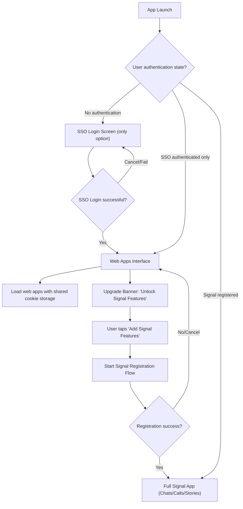

# Phase 1: MVP Progressive Registration (AI-Implementable)

**Goal:** Get basic progressive registration working - SSO → Web Apps → Signal upgrade flow

**Estimated Time:** 2-3 AI sessions (3-4 hours total)

## Overview

Replace the registration flow with a progressive system. Users start with SSO authentication for web app access, then can gradually unlock full Signal features (messaging, calls, stories) through an optional upgrade flow.

### Simplified Flow



### Key touchpoints

- `Signal/src/Models/AppAuthenticationState.swift`: state machine for authentication levels
- `Signal/src/ViewControllers/SSO/SsoWebAppViewController.swift`: web apps interface with upgrade banner
- `Signal/src/Utilities/UpgradeBannerManager.swift`: manage upgrade prompts and simple error toasts
- `Signal/AppLaunch/AppDelegate.swift`: basic routing logic (simplified)

---

## Step 1: Add Authentication State Machine

Create `Signal/src/Models/AppAuthenticationState.swift`:

```swift
import Foundation
import SignalServiceKit

enum AppAuthenticationState {
    case noAuthentication
    case ssoOnly
    case signalRegistered

    var description: String {
        switch self {
        case .noAuthentication: return "No authentication"
        case .ssoOnly: return "SSO authenticated only"
        case .signalRegistered: return "Full Signal registration"
        }
    }
}

final class AppAuthenticationStateManager {
    static let shared = AppAuthenticationStateManager()

    private init() {}

    var currentState: AppAuthenticationState {
        let isSignalRegistered = DependenciesBridge.shared.tsAccountManager
            .registrationStateWithMaybeSneakyTransaction.isRegistered

        if isSignalRegistered {
            return .signalRegistered
        }

        // Simplified: Check for SSO authentication (mock for now)
        let isSsoAuthenticated = MockSsoAuthenticationManager.shared.isAuthenticated
        if isSsoAuthenticated {
            return .ssoOnly
        }

        return .noAuthentication
    }

    func canTransition(to newState: AppAuthenticationState) -> Bool {
        switch (currentState, newState) {
        case (.noAuthentication, .ssoOnly),
             (.ssoOnly, .signalRegistered),
             (.signalRegistered, .noAuthentication), // logout
             (.ssoOnly, .noAuthentication): // logout
            return true
        default:
            return false
        }
    }
}

// Simplified mock for Phase 1 - replace in Phase 2
final class MockSsoAuthenticationManager {
    static let shared = MockSsoAuthenticationManager()
    private init() {}

    // For testing - toggle this to simulate SSO state
    var isAuthenticated: Bool = true

    func logout() {
        isAuthenticated = false
    }
}
```

---

## Step 2: Add Web Apps View Controller

Create `Signal/src/ViewControllers/SSO/SsoWebAppViewController.swift`:

```swift
import UIKit
import SignalServiceKit
import WebKit

final class SsoWebAppViewController: UIViewController {
    private let webView: WKWebView
    private let upgradeBannerManager: UpgradeBannerManager
    private var upgradeBanner: UIView?

    init() {
        // Basic WebView configuration for Phase 1
        let config = WKWebViewConfiguration()
        self.webView = WKWebView(frame: .zero, configuration: config)
        self.upgradeBannerManager = UpgradeBannerManager()
        super.init(nibName: nil, bundle: nil)
    }
    required init?(coder: NSCoder) { fatalError("init(coder:) has not been implemented") }

    override func viewDidLoad() {
        super.viewDidLoad()
        view.backgroundColor = Theme.backgroundColor
        title = "Web Apps"

        setupWebView()
        setupUpgradeBanner()
        loadDefaultWebApp()
    }

    private func setupWebView() {
        webView.translatesAutoresizingMaskIntoConstraints = false
        view.addSubview(webView)
    }

    private func setupUpgradeBanner() {
        upgradeBanner = upgradeBannerManager.createUpgradeBanner { [weak self] in
            self?.startSignalRegistration()
        }

        if let banner = upgradeBanner {
            view.addSubview(banner)

            NSLayoutConstraint.activate([
                banner.topAnchor.constraint(equalTo: view.safeAreaLayoutGuide.topAnchor),
                banner.leadingAnchor.constraint(equalTo: view.leadingAnchor),
                banner.trailingAnchor.constraint(equalTo: view.trailingAnchor),
                banner.heightAnchor.constraint(equalToConstant: 60),

                webView.topAnchor.constraint(equalTo: banner.bottomAnchor),
                webView.leadingAnchor.constraint(equalTo: view.leadingAnchor),
                webView.trailingAnchor.constraint(equalTo: view.trailingAnchor),
                webView.bottomAnchor.constraint(equalTo: view.bottomAnchor)
            ])
        }
    }

    private func loadDefaultWebApp() {
        // Placeholder URL for Phase 1 - replace with actual web app
        if let defaultURL = URL(string: "https://signal.org") {
            webView.load(URLRequest(url: defaultURL))
        }
    }

    private func startSignalRegistration() {
        // Simplified registration start for Phase 1
        let alertController = UIAlertController(
            title: "Start Signal Registration",
            message: "This will start the Signal registration process. Continue?",
            preferredStyle: .alert
        )

        alertController.addAction(UIAlertAction(title: "Cancel", style: .cancel))
        alertController.addAction(UIAlertAction(title: "Continue", style: .default) { _ in
            // TODO: Integrate with actual Signal registration in Phase 2
            self.showSuccessMessage()
        })

        present(alertController, animated: true)
    }

    private func showSuccessMessage() {
        upgradeBannerManager.showToast(
            message: "Signal registration would start here",
            in: view
        )
    }
}
```

---

## Step 3: Add Upgrade Banner Manager

Create `Signal/src/Utilities/UpgradeBannerManager.swift`:

```swift
import UIKit
import SignalServiceKit

final class UpgradeBannerManager {
    private var currentToast: UIView?

    func createUpgradeBanner(onTap: @escaping () -> Void) -> UIView {
        let container = UIView()
        container.backgroundColor = .systemBlue
        container.translatesAutoresizingMaskIntoConstraints = false

        let iconImageView = UIImageView(image: UIImage(systemName: "message.badge"))
        iconImageView.tintColor = .white
        iconImageView.translatesAutoresizingMaskIntoConstraints = false

        let titleLabel = UILabel()
        titleLabel.text = "Add Signal Features"
        titleLabel.font = UIFont.preferredFont(forTextStyle: .headline)
        titleLabel.textColor = .white
        titleLabel.translatesAutoresizingMaskIntoConstraints = false

        let subtitleLabel = UILabel()
        subtitleLabel.text = "Unlock messaging, calls & stories"
        subtitleLabel.font = UIFont.preferredFont(forTextStyle: .caption1)
        subtitleLabel.textColor = .white.withAlphaComponent(0.8)
        subtitleLabel.translatesAutoresizingMaskIntoConstraints = false

        let upgradeButton = UIButton(type: .system)
        upgradeButton.setTitle("Add Features", for: .normal)
        upgradeButton.setTitleColor(.white, for: .normal)
        upgradeButton.titleLabel?.font = UIFont.preferredFont(forTextStyle: .subheadline).semibold()
        upgradeButton.layer.borderColor = UIColor.white.cgColor
        upgradeButton.layer.borderWidth = 1
        upgradeButton.layer.cornerRadius = 6
        upgradeButton.translatesAutoresizingMaskIntoConstraints = false
        upgradeButton.addTarget(self, action: #selector(upgradeButtonTapped), for: .touchUpInside)

        // Store the tap action using objc runtime
        objc_setAssociatedObject(upgradeButton, "tapAction", onTap, .OBJC_ASSOCIATION_RETAIN_NONATOMIC)

        let textStack = UIStackView(arrangedSubviews: [titleLabel, subtitleLabel])
        textStack.axis = .vertical
        textStack.spacing = 2
        textStack.translatesAutoresizingMaskIntoConstraints = false

        container.addSubview(iconImageView)
        container.addSubview(textStack)
        container.addSubview(upgradeButton)

        NSLayoutConstraint.activate([
            iconImageView.leadingAnchor.constraint(equalTo: container.leadingAnchor, constant: 16),
            iconImageView.centerYAnchor.constraint(equalTo: container.centerYAnchor),
            iconImageView.widthAnchor.constraint(equalToConstant: 24),
            iconImageView.heightAnchor.constraint(equalToConstant: 24),

            textStack.leadingAnchor.constraint(equalTo: iconImageView.trailingAnchor, constant: 12),
            textStack.centerYAnchor.constraint(equalTo: container.centerYAnchor),

            upgradeButton.trailingAnchor.constraint(equalTo: container.trailingAnchor, constant: -16),
            upgradeButton.centerYAnchor.constraint(equalTo: container.centerYAnchor),
            upgradeButton.widthAnchor.constraint(equalToConstant: 100),
            upgradeButton.heightAnchor.constraint(equalToConstant: 32),

            textStack.trailingAnchor.constraint(lessThanOrEqualTo: upgradeButton.leadingAnchor, constant: -12)
        ])

        return container
    }

    @objc private func upgradeButtonTapped(_ sender: UIButton) {
        if let tapAction = objc_getAssociatedObject(sender, "tapAction") as? () -> Void {
            tapAction()
        }
    }

    func showToast(message: String, in parentView: UIView) {
        // Dismiss any existing toast
        dismissCurrentToast()

        let toast = createToast(message: message)
        currentToast = toast

        parentView.addSubview(toast)

        NSLayoutConstraint.activate([
            toast.leadingAnchor.constraint(equalTo: parentView.leadingAnchor, constant: 16),
            toast.trailingAnchor.constraint(equalTo: parentView.trailingAnchor, constant: -16),
            toast.bottomAnchor.constraint(equalTo: parentView.safeAreaLayoutGuide.bottomAnchor, constant: -16)
        ])

        // Animate in
        toast.transform = CGAffineTransform(translationX: 0, y: 100)
        UIView.animate(withDuration: 0.3, delay: 0, options: .curveEaseOut) {
            toast.transform = .identity
        }

        // Auto-dismiss after 3 seconds
        DispatchQueue.main.asyncAfter(deadline: .now() + 3) { [weak self] in
            self?.dismissCurrentToast()
        }
    }

    private func createToast(message: String) -> UIView {
        let container = UIView()
        container.backgroundColor = .systemGreen
        container.layer.cornerRadius = 8
        container.translatesAutoresizingMaskIntoConstraints = false

        let label = UILabel()
        label.text = message
        label.textColor = .white
        label.font = UIFont.preferredFont(forTextStyle: .subheadline)
        label.numberOfLines = 0
        label.translatesAutoresizingMaskIntoConstraints = false

        container.addSubview(label)

        NSLayoutConstraint.activate([
            label.leadingAnchor.constraint(equalTo: container.leadingAnchor, constant: 16),
            label.trailingAnchor.constraint(equalTo: container.trailingAnchor, constant: -16),
            label.topAnchor.constraint(equalTo: container.topAnchor, constant: 12),
            label.bottomAnchor.constraint(equalTo: container.bottomAnchor, constant: -12)
        ])

        return container
    }

    private func dismissCurrentToast() {
        guard let toast = currentToast else { return }

        UIView.animate(withDuration: 0.3, delay: 0, options: .curveEaseIn) {
            toast.transform = CGAffineTransform(translationX: 0, y: 100)
            toast.alpha = 0
        } completion: { _ in
            toast.removeFromSuperview()
        }

        currentToast = nil
    }
}
```

---

## Step 4: Basic App Launch Integration

**Note:** This step requires identifying the correct location in the existing Signal codebase for app launch routing. For now, here's the conceptual integration:

Add to `Signal/AppLaunch/AppDelegate.swift` (or wherever app launch routing occurs):

```swift
// Conceptual integration - exact location depends on existing Signal architecture
private func determineAppMode() -> AppMode {
    let currentState = AppAuthenticationStateManager.shared.currentState

    switch currentState {
    case .signalRegistered:
        return .chatList // Full Signal app with chats/calls/stories
    case .ssoOnly:
        return .webApps // Web apps interface with upgrade banner
    case .noAuthentication:
        return .ssoLogin // Show SSO login screen (mock for Phase 1)
    }
}

// Update launch routing to include new web apps mode
// This will need to be integrated with existing Signal app launch logic
```

---

## Step 5: Testing & Validation

### Manual Testing Checklist:

**State Machine:**

- [ ] `AppAuthenticationStateManager.shared.currentState` returns correct state
- [ ] State transitions work as expected
- [ ] Mock SSO manager can be toggled for testing

**Web Apps Interface:**

- [ ] `SsoWebAppViewController` displays with upgrade banner
- [ ] WebView loads placeholder content
- [ ] Banner shows correct text and styling

**Upgrade Banner:**

- [ ] Banner displays prominently at top
- [ ] Tap action triggers alert dialog
- [ ] Toast message appears and auto-dismisses

**Integration:**

- [ ] App can route to web apps interface
- [ ] Mock SSO state affects routing

---

## Phase 1 Success Criteria

✅ **Core flow working:** No Auth → (SSO Mock) → Web Apps → Upgrade Banner  
✅ **Basic UI:** Web view with upgrade banner displays correctly  
✅ **State management:** Authentication state machine functions  
✅ **Upgrade flow:** Banner tap triggers placeholder registration  
✅ **Error handling:** Basic toast messages work

## Next Steps

After Phase 1 completion:

- **Phase 2:** Replace mocks with real SSO integration, add proper Signal registration
- **Phase 3:** Add security, accessibility, and production features

---

## Files Created in Phase 1

**New Files:**

- `Signal/src/Models/AppAuthenticationState.swift`
- `Signal/src/ViewControllers/SSO/SsoWebAppViewController.swift`
- `Signal/src/Utilities/UpgradeBannerManager.swift`

**Modified Files:**

- `Signal/AppLaunch/AppDelegate.swift` (routing integration)

**Key Dependencies to Mock:**

- SSO authentication (using MockSsoAuthenticationManager)
- Signal registration flow (placeholder alert)
- Proper theme integration (basic colors for now)
