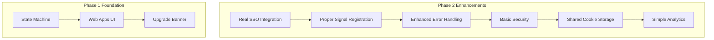

# Phase 2: Integration & Polish (AI-Assisted)

**Goal:** Replace mocks with real implementations, add security, error handling, and basic accessibility

**Estimated Time:** 5-7 hours (mix of AI and manual work)

## Overview

Build upon Phase 1 MVP by integrating real SSO authentication, proper Signal registration flow, enhanced error handling, and basic security measures.

### Phase 2 Additions



---

## Step 1: Real SSO Authentication Manager

Replace `MockSsoAuthenticationManager` with real implementation.

Create `Signal/src/SSO/SsoAuthenticationManager.swift`:

```swift
import Foundation
import SignalServiceKit

final class SsoAuthenticationManager {
    static let shared = SsoAuthenticationManager()

    private var authState: SsoAuthState = .unauthenticated
    private let allowedDomains = ["your-company.com"] // Configure for your org

    private init() {
        loadPersistedAuthState()
    }

    var isAuthenticated: Bool {
        switch authState {
        case .authenticated: return true
        case .unauthenticated, .expired: return false
        }
    }

    func authenticate(with credentials: SsoCredentials) async throws {
        do {
            let token = try await performAuthentication(credentials)
            authState = .authenticated(token: token, expiresAt: Date().addingTimeInterval(3600))
            persistAuthState()
        } catch {
            throw SsoAuthError.authenticationFailed(error.localizedDescription)
        }
    }

    func validateSession() async -> Bool {
        guard case .authenticated(let token, let expiresAt) = authState else {
            return false
        }

        if Date() > expiresAt {
            authState = .expired
            return false
        }

        // Simple token validation
        return await validateToken(token)
    }

    func logout() {
        authState = .unauthenticated
        clearPersistedAuthState()
    }

    // MARK: - Private Methods

    private func performAuthentication(_ credentials: SsoCredentials) async throws -> String {
        // Implement your actual SSO flow here
        // This could be SAML, OAuth, or custom protocol

        // Placeholder implementation - replace with real SSO
        guard credentials.username.contains("@"), !credentials.password.isEmpty else {
            throw SsoAuthError.invalidCredentials
        }

        // Simulate network call
        try await Task.sleep(nanoseconds: 1_000_000_000) // 1 second

        // Return mock token - replace with real token from SSO provider
        return "sso_token_\(Date().timeIntervalSince1970)"
    }

    private func validateToken(_ token: String) async -> Bool {
        // Implement token validation with your SSO provider
        // For now, simple validation
        return token.hasPrefix("sso_token_")
    }

    private func loadPersistedAuthState() {
        // Load from UserDefaults for Phase 2 (upgrade to Keychain in Phase 3)
        if let tokenData = UserDefaults.standard.data(forKey: "sso_auth_token"),
           let token = String(data: tokenData, encoding: .utf8) {
            authState = .authenticated(token: token, expiresAt: Date().addingTimeInterval(3600))
        }
    }

    private func persistAuthState() {
        switch authState {
        case .authenticated(let token, _):
            let tokenData = Data(token.utf8)
            UserDefaults.standard.set(tokenData, forKey: "sso_auth_token")
        case .unauthenticated, .expired:
            clearPersistedAuthState()
        }
    }

    private func clearPersistedAuthState() {
        UserDefaults.standard.removeObject(forKey: "sso_auth_token")
    }
}

enum SsoAuthState {
    case unauthenticated
    case authenticated(token: String, expiresAt: Date)
    case expired
}

struct SsoCredentials {
    let username: String
    let password: String
}

enum SsoAuthError: LocalizedError {
    case invalidCredentials
    case authenticationFailed(String)
    case networkError

    var errorDescription: String? {
        switch self {
        case .invalidCredentials:
            return "Invalid username or password"
        case .authenticationFailed(let message):
            return "Authentication failed: \(message)"
        case .networkError:
            return "Network error. Please check your connection."
        }
    }
}
```

---

## Step 2: Enhanced Shared WebView with Cookie Management

Update `Signal/src/ViewControllers/SSO/SsoSharedWebView.swift` (create if doesn't exist):

```swift
import UIKit
import WebKit

final class SsoSharedWebView: WKWebView {
    static let sharedProcessPool = WKProcessPool()

    convenience init() {
        let config = SsoSharedWebView.createSharedConfiguration()
        self.init(frame: .zero, configuration: config)
        self.navigationDelegate = self
    }

    private static func createSharedConfiguration() -> WKWebViewConfiguration {
        let config = WKWebViewConfiguration()
        config.processPool = sharedProcessPool
        config.websiteDataStore = WKWebsiteDataStore.default()

        // Basic security configuration
        config.preferences.javaScriptEnabled = true
        config.preferences.javaScriptCanOpenWindowsAutomatically = false

        return config
    }

    func loadWebApp(url: URL) {
        // Validate URL before loading
        guard SsoUrlValidator.shared.isValidWebAppUrl(url) else {
            print("⚠️ Invalid web app URL: \(url)")
            return
        }

        var request = URLRequest(url: url)

        // Add SSO token to request if available
        if let token = getSsoToken() {
            request.setValue("Bearer \(token)", forHTTPHeaderField: "Authorization")
        }

        load(request)
    }

    func clearSSOSession() {
        let dataStore = WKWebsiteDataStore.default()
        let types = Set([WKWebsiteDataTypeCookies, WKWebsiteDataTypeSessionStorage])

        dataStore.removeData(ofTypes: types, modifiedSince: Date.distantPast) { [weak self] in
            DispatchQueue.main.async {
                self?.reload()
            }
        }
    }

    private func getSsoToken() -> String? {
        guard case .authenticated(let token, _) = SsoAuthenticationManager.shared.authState else {
            return nil
        }
        return token
    }
}

extension SsoSharedWebView: WKNavigationDelegate {
    func webView(_ webView: WKWebView, decidePolicyFor navigationAction: WKNavigationAction, decisionHandler: @escaping (WKNavigationActionPolicy) -> Void) {

        guard let url = navigationAction.request.url else {
            decisionHandler(.cancel)
            return
        }

        // Validate all navigation attempts
        if SsoUrlValidator.shared.isValidWebAppUrl(url) {
            decisionHandler(.allow)
        } else {
            print("🚫 Blocked navigation to invalid URL: \(url)")
            decisionHandler(.cancel)
        }
    }

    func webView(_ webView: WKWebView, didFailProvisionalNavigation navigation: WKNavigation!, withError error: Error) {
        print("❌ Web navigation failed: \(error.localizedDescription)")
        // Could show error UI here
    }
}

final class SsoUrlValidator {
    static let shared = SsoUrlValidator()
    private let allowedDomains = ["your-company.com", "your-webapp.com"] // Configure

    private init() {}

    func isValidWebAppUrl(_ url: URL) -> Bool {
        guard url.scheme == "https" else { return false }
        guard let host = url.host else { return false }
        return allowedDomains.contains(host) || allowedDomains.contains { host.hasSuffix(".\($0)") }
    }
}
```

---

## Step 3: Proper Signal Registration Integration

Update `Signal/src/ViewControllers/SSO/SsoWebAppViewController.swift`:

```swift
// Replace the startSignalRegistration method with real integration:

private func startSignalRegistration() {
    // Show loading state
    showLoadingOverlay()

    // Attempt to start real Signal registration
    do {
        let loader = RegistrationCoordinatorLoaderImpl(dependencies: .from(self))

        // Hide loading and start registration
        hideLoadingOverlay()

        // This should integrate with Signal's existing registration flow
        SignalApp.shared.showRegistration(
            loader: loader,
            desiredMode: .registering,
            appReadiness: AppReadiness.shared
        )

        // Listen for registration completion
        NotificationCenter.default.addObserver(
            self,
            selector: #selector(registrationStateDidChange),
            name: .registrationStateDidChange,
            object: nil
        )

    } catch {
        hideLoadingOverlay()
        showRegistrationError(error)
    }
}

@objc private func registrationStateDidChange() {
    guard DependenciesBridge.shared.tsAccountManager.registrationStateWithMaybeSneakyTransaction.isRegistered else { return }

    // Registration completed successfully
    DispatchQueue.main.async {
        self.upgradeBannerManager.showToast(
            message: "Signal registration completed! Restarting app...",
            in: self.view
        )

        // Transition to full Signal app
        DispatchQueue.main.asyncAfter(deadline: .now() + 2) {
            SignalApp.shared.showMainUI()
        }
    }
}

private func showLoadingOverlay() {
    let loadingView = UIView()
    loadingView.backgroundColor = UIColor.black.withAlphaComponent(0.3)
    loadingView.tag = 1001

    let spinner = UIActivityIndicatorView(style: .large)
    spinner.color = .white
    spinner.translatesAutoresizingMaskIntoConstraints = false

    loadingView.addSubview(spinner)
    view.addSubview(loadingView)
    loadingView.frame = view.bounds

    NSLayoutConstraint.activate([
        spinner.centerXAnchor.constraint(equalTo: loadingView.centerXAnchor),
        spinner.centerYAnchor.constraint(equalTo: loadingView.centerYAnchor)
    ])

    spinner.startAnimating()
}

private func hideLoadingOverlay() {
    view.subviews.first { $0.tag == 1001 }?.removeFromSuperview()
}

private func showRegistrationError(_ error: Error) {
    upgradeBannerManager.showErrorToast(
        message: "Registration failed: \(error.localizedDescription)",
        in: view
    )
}
```

---

## Step 4: Enhanced Error Handling

Update `Signal/src/Utilities/UpgradeBannerManager.swift` with error handling:

```swift
// Add these methods to UpgradeBannerManager:

func showErrorToast(message: String, in parentView: UIView) {
    // Dismiss any existing toast
    dismissCurrentToast()

    let toast = createErrorToast(message: message)
    currentToast = toast

    parentView.addSubview(toast)

    NSLayoutConstraint.activate([
        toast.leadingAnchor.constraint(equalTo: parentView.leadingAnchor, constant: 16),
        toast.trailingAnchor.constraint(equalTo: parentView.trailingAnchor, constant: -16),
        toast.bottomAnchor.constraint(equalTo: parentView.safeAreaLayoutGuide.bottomAnchor, constant: -16)
    ])

    // Animate in
    toast.transform = CGAffineTransform(translationX: 0, y: 100)
    UIView.animate(withDuration: 0.3, delay: 0, options: .curveEaseOut) {
        toast.transform = .identity
    }

    // Auto-dismiss after 4 seconds (longer for errors)
    DispatchQueue.main.asyncAfter(deadline: .now() + 4) { [weak self] in
        self?.dismissCurrentToast()
    }
}

private func createErrorToast(message: String) -> UIView {
    let container = UIView()
    container.backgroundColor = .systemRed
    container.layer.cornerRadius = 8
    container.translatesAutoresizingMaskIntoConstraints = false

    let iconImageView = UIImageView(image: UIImage(systemName: "exclamationmark.triangle.fill"))
    iconImageView.tintColor = .white
    iconImageView.translatesAutoresizingMaskIntoConstraints = false

    let label = UILabel()
    label.text = message
    label.textColor = .white
    label.font = UIFont.preferredFont(forTextStyle: .subheadline)
    label.numberOfLines = 0
    label.translatesAutoresizingMaskIntoConstraints = false

    container.addSubview(iconImageView)
    container.addSubview(label)

    NSLayoutConstraint.activate([
        iconImageView.leadingAnchor.constraint(equalTo: container.leadingAnchor, constant: 16),
        iconImageView.centerYAnchor.constraint(equalTo: container.centerYAnchor),
        iconImageView.widthAnchor.constraint(equalToConstant: 20),
        iconImageView.heightAnchor.constraint(equalToConstant: 20),

        label.leadingAnchor.constraint(equalTo: iconImageView.trailingAnchor, constant: 12),
        label.trailingAnchor.constraint(equalTo: container.trailingAnchor, constant: -16),
        label.topAnchor.constraint(equalTo: container.topAnchor, constant: 12),
        label.bottomAnchor.constraint(equalTo: container.bottomAnchor, constant: -12)
    ])

    return container
}
```

---

## Step 5: Basic Analytics

Create `Signal/src/Analytics/SsoAnalytics.swift`:

```swift
import Foundation

final class SsoAnalytics {
    static let shared = SsoAnalytics()
    private init() {}

    // Basic analytics - integrate with your existing analytics system
    func trackSsoLoginAttempt() {
        logEvent("sso_login_attempt")
    }

    func trackSsoLoginSuccess() {
        logEvent("sso_login_success")
    }

    func trackSsoLoginFailure(_ error: Error) {
        logEvent("sso_login_failure", parameters: ["error": error.localizedDescription])
    }

    func trackUpgradeBannerShown() {
        logEvent("upgrade_banner_shown")
    }

    func trackUpgradeBannerTapped() {
        logEvent("upgrade_banner_tapped")
    }

    func trackRegistrationStarted() {
        logEvent("signal_registration_started")
    }

    func trackRegistrationCompleted() {
        logEvent("signal_registration_completed")
    }

    func trackRegistrationFailed(_ error: Error) {
        logEvent("signal_registration_failed", parameters: ["error": error.localizedDescription])
    }

    func trackWebAppNavigation(_ url: URL) {
        logEvent("web_app_navigation", parameters: ["url": url.host ?? "unknown"])
    }

    private func logEvent(_ name: String, parameters: [String: Any] = [:]) {
        // Replace with your actual analytics implementation
        // Options: Firebase, Amplitude, or Signal's existing analytics

        #if DEBUG
        print("📊 Analytics: \(name)")
        if !parameters.isEmpty {
            print("   Parameters: \(parameters)")
        }
        #endif

        // TODO: Integrate with real analytics system
        // Example: Firebase.Analytics.logEvent(name, parameters: parameters)
    }
}
```

Update view controllers to use analytics:

```swift
// In SsoWebAppViewController.swift viewDidLoad:
override func viewDidLoad() {
    super.viewDidLoad()
    // ... existing code ...

    SsoAnalytics.shared.trackUpgradeBannerShown()
}

// In upgrade banner tap:
private func startSignalRegistration() {
    SsoAnalytics.shared.trackUpgradeBannerTapped()
    SsoAnalytics.shared.trackRegistrationStarted()

    // ... existing registration code ...
}
```

---

## Step 6: Update Authentication State Manager

Update `Signal/src/Models/AppAuthenticationState.swift` to use real SSO manager:

```swift
// Replace MockSsoAuthenticationManager usage:
var currentState: AppAuthenticationState {
    let isSignalRegistered = DependenciesBridge.shared.tsAccountManager
        .registrationStateWithMaybeSneakyTransaction.isRegistered

    if isSignalRegistered {
        return .signalRegistered
    }

    // Use real SSO authentication manager
    let isSsoAuthenticated = SsoAuthenticationManager.shared.isAuthenticated
    if isSsoAuthenticated {
        return .ssoOnly
    }

    return .noAuthentication
}

// Remove MockSsoAuthenticationManager class entirely
```

---

## Step 7: Basic SSO Login Screen

Create `Signal/src/ViewControllers/SSO/SsoLoginViewController.swift`:

```swift
import UIKit

final class SsoLoginViewController: UIViewController {
    private let scrollView = UIScrollView()
    private let contentView = UIView()
    private let usernameTextField = UITextField()
    private let passwordTextField = UITextField()
    private let loginButton = UIButton(type: .system)
    private let loadingIndicator = UIActivityIndicatorView(style: .medium)

    override func viewDidLoad() {
        super.viewDidLoad()
        setupUI()
        setupConstraints()

        SsoAnalytics.shared.trackSsoLoginAttempt()
    }

    private func setupUI() {
        view.backgroundColor = Theme.backgroundColor
        title = "Sign In"

        // Username field
        usernameTextField.placeholder = "Email"
        usernameTextField.borderStyle = .roundedRect
        usernameTextField.keyboardType = .emailAddress
        usernameTextField.autocapitalizationType = .none
        usernameTextField.translatesAutoresizingMaskIntoConstraints = false

        // Password field
        passwordTextField.placeholder = "Password"
        passwordTextField.borderStyle = .roundedRect
        passwordTextField.isSecureTextEntry = true
        passwordTextField.translatesAutoresizingMaskIntoConstraints = false

        // Login button
        loginButton.setTitle("Sign In", for: .normal)
        loginButton.backgroundColor = .systemBlue
        loginButton.setTitleColor(.white, for: .normal)
        loginButton.layer.cornerRadius = 8
        loginButton.translatesAutoresizingMaskIntoConstraints = false
        loginButton.addTarget(self, action: #selector(loginTapped), for: .touchUpInside)

        // Loading indicator
        loadingIndicator.translatesAutoresizingMaskIntoConstraints = false
        loadingIndicator.hidesWhenStopped = true

        // Setup scroll view
        scrollView.translatesAutoresizingMaskIntoConstraints = false
        contentView.translatesAutoresizingMaskIntoConstraints = false

        view.addSubview(scrollView)
        scrollView.addSubview(contentView)
        contentView.addSubview(usernameTextField)
        contentView.addSubview(passwordTextField)
        contentView.addSubview(loginButton)
        contentView.addSubview(loadingIndicator)
    }

    private func setupConstraints() {
        NSLayoutConstraint.activate([
            // Scroll view
            scrollView.topAnchor.constraint(equalTo: view.safeAreaLayoutGuide.topAnchor),
            scrollView.leadingAnchor.constraint(equalTo: view.leadingAnchor),
            scrollView.trailingAnchor.constraint(equalTo: view.trailingAnchor),
            scrollView.bottomAnchor.constraint(equalTo: view.bottomAnchor),

            // Content view
            contentView.topAnchor.constraint(equalTo: scrollView.topAnchor),
            contentView.leadingAnchor.constraint(equalTo: scrollView.leadingAnchor),
            contentView.trailingAnchor.constraint(equalTo: scrollView.trailingAnchor),
            contentView.bottomAnchor.constraint(equalTo: scrollView.bottomAnchor),
            contentView.widthAnchor.constraint(equalTo: scrollView.widthAnchor),

            // Form elements
            usernameTextField.topAnchor.constraint(equalTo: contentView.topAnchor, constant: 100),
            usernameTextField.leadingAnchor.constraint(equalTo: contentView.leadingAnchor, constant: 20),
            usernameTextField.trailingAnchor.constraint(equalTo: contentView.trailingAnchor, constant: -20),
            usernameTextField.heightAnchor.constraint(equalToConstant: 44),

            passwordTextField.topAnchor.constraint(equalTo: usernameTextField.bottomAnchor, constant: 16),
            passwordTextField.leadingAnchor.constraint(equalTo: usernameTextField.leadingAnchor),
            passwordTextField.trailingAnchor.constraint(equalTo: usernameTextField.trailingAnchor),
            passwordTextField.heightAnchor.constraint(equalToConstant: 44),

            loginButton.topAnchor.constraint(equalTo: passwordTextField.bottomAnchor, constant: 24),
            loginButton.leadingAnchor.constraint(equalTo: passwordTextField.leadingAnchor),
            loginButton.trailingAnchor.constraint(equalTo: passwordTextField.trailingAnchor),
            loginButton.heightAnchor.constraint(equalToConstant: 50),

            loadingIndicator.centerXAnchor.constraint(equalTo: loginButton.centerXAnchor),
            loadingIndicator.centerYAnchor.constraint(equalTo: loginButton.centerYAnchor),

            contentView.bottomAnchor.constraint(greaterThanOrEqualTo: loginButton.bottomAnchor, constant: 100)
        ])
    }

    @objc private func loginTapped() {
        guard let username = usernameTextField.text, !username.isEmpty,
              let password = passwordTextField.text, !password.isEmpty else {
            showError("Please enter both email and password")
            return
        }

        performLogin(username: username, password: password)
    }

    private func performLogin(username: String, password: String) {
        setLoginState(isLoading: true)

        let credentials = SsoCredentials(username: username, password: password)

        Task {
            do {
                try await SsoAuthenticationManager.shared.authenticate(with: credentials)

                await MainActor.run {
                    SsoAnalytics.shared.trackSsoLoginSuccess()
                    self.handleLoginSuccess()
                }
            } catch {
                await MainActor.run {
                    SsoAnalytics.shared.trackSsoLoginFailure(error)
                    self.setLoginState(isLoading: false)
                    self.showError(error.localizedDescription)
                }
            }
        }
    }

    private func handleLoginSuccess() {
        // Navigate to web apps interface
        let webAppsVC = SsoWebAppViewController()
        navigationController?.setViewControllers([webAppsVC], animated: true)
    }

    private func setLoginState(isLoading: Bool) {
        loginButton.isEnabled = !isLoading
        usernameTextField.isEnabled = !isLoading
        passwordTextField.isEnabled = !isLoading

        if isLoading {
            loadingIndicator.startAnimating()
        } else {
            loadingIndicator.stopAnimating()
        }
    }

    private func showError(_ message: String) {
        let alert = UIAlertController(title: "Login Failed", message: message, preferredStyle: .alert)
        alert.addAction(UIAlertAction(title: "OK", style: .default))
        present(alert, animated: true)
    }
}
```

---

## Phase 2 Testing Checklist

### SSO Authentication:

- [ ] Login screen accepts credentials
- [ ] Successful login navigates to web apps
- [ ] Failed login shows error message
- [ ] Session persistence across app restarts

### Web Apps Interface:

- [ ] WebView loads with SSO session
- [ ] Shared cookies work between web apps
- [ ] URL validation blocks unauthorized domains

### Signal Registration:

- [ ] Upgrade banner triggers real registration flow
- [ ] Registration completion transitions to full Signal
- [ ] Registration failure returns to web apps with error

### Error Handling:

- [ ] Network errors show appropriate messages
- [ ] Authentication failures are handled gracefully
- [ ] Loading states display correctly

### Analytics:

- [ ] Events are logged correctly
- [ ] Error events include relevant details

---

## Phase 2 Success Criteria

✅ **Real SSO:** Actual authentication with credentials  
✅ **Signal Integration:** Proper registration flow integration  
✅ **Error Handling:** Comprehensive error states and recovery  
✅ **Security:** Basic URL validation and HTTPS enforcement  
✅ **Analytics:** Event tracking throughout the flow  
✅ **Persistence:** Session management across app restarts

## Files Modified/Created in Phase 2

**New Files:**

- `Signal/src/SSO/SsoAuthenticationManager.swift`
- `Signal/src/ViewControllers/SSO/SsoSharedWebView.swift`
- `Signal/src/ViewControllers/SSO/SsoLoginViewController.swift`
- `Signal/src/Analytics/SsoAnalytics.swift`

**Modified Files:**

- `Signal/src/Models/AppAuthenticationState.swift` (remove mock)
- `Signal/src/ViewControllers/SSO/SsoWebAppViewController.swift` (real registration)
- `Signal/src/Utilities/UpgradeBannerManager.swift` (error handling)

**Integration Points:**

- App launch routing to include login screen
- Registration flow integration points
- Analytics system integration
