# Phase 3: Advanced Features (Manual Implementation)

**Goal:** Production-ready features including comprehensive security, accessibility, recovery mechanisms, and performance optimization

**Estimated Time:** 10-15 hours (primarily manual development)

## Overview

Phase 3 focuses on production-grade features that require deep iOS expertise, security considerations, and comprehensive testing. These features are typically beyond the scope of AI implementation due to their complexity and security implications.

### Phase 3 Advanced Features

```mermaid
flowchart TD
  subgraph "Security & Compliance"
    A["SSL Certificate Pinning"] --> B["Keychain Storage"]
    B --> C["Token Refresh Logic"]
    C --> D["CSRF Protection"]
  end

  subgraph "Accessibility & UX"
    E["VoiceOver Support"] --> F["Dynamic Type"]
    F --> G["High Contrast Mode"]
    G --> H["Keyboard Navigation"]
  end

  subgraph "Robustness"
    I["State Recovery"] --> J["Background Tasks"]
    J --> K["Offline Handling"]
    K --> L["Deep Link Routing"]
  end

  subgraph "Performance"
    M["Memory Management"] --> N["Lazy Loading"]
    N --> O["Cache Strategies"]
    O --> P["Performance Monitoring"]
  end
```



---

## Step 1: Production Security Implementation

### Enhanced SSL Certificate Pinning

Create `Signal/src/Security/SsoSecurityManager.swift`:

```swift
import Foundation
import Security
import CryptoKit
import Network

final class SsoSecurityManager {
    static let shared = SsoSecurityManager()
    private let keychain = SsoKeychainManager()
    private let certificatePinner = CertificatePinner()

    // Production domain configuration
    private let allowedDomains = [
        "your-production-sso.com",
        "your-production-webapp.com"
    ]

    // Certificate hashes for pinning (replace with your actual certificate hashes)
    private let pinnedCertificateHashes = [
        "sha256/AAAAAAAAAAAAAAAAAAAAAAAAAAAAAAAAAAAAAAAAAAA=",
        "sha256/BBBBBBBBBBBBBBBBBBBBBBBBBBBBBBBBBBBBBBBBBBB="
    ]

    private init() {
        setupNetworkMonitoring()
    }

    // MARK: - Token Management

    func storeToken(_ token: String, withRefreshToken refreshToken: String?) {
        keychain.storeToken(token)
        if let refreshToken = refreshToken {
            keychain.storeRefreshToken(refreshToken)
        }
    }

    func retrieveToken() -> String? {
        return keychain.retrieveToken()
    }

    func refreshTokenIfNeeded() async throws {
        guard let currentToken = keychain.retrieveToken(),
              isTokenExpiring(currentToken) else { return }

        guard let refreshToken = keychain.retrieveRefreshToken() else {
            throw SsoSecurityError.noRefreshToken
        }

        let newTokens = try await requestTokenRefresh(refreshToken: refreshToken)
        storeToken(newTokens.accessToken, withRefreshToken: newTokens.refreshToken)
    }

    func deleteAllTokens() {
        keychain.deleteToken()
        keychain.deleteRefreshToken()
    }

    // MARK: - Certificate Pinning

    func setupSSLPinning() {
        URLSessionConfiguration.default.urlSessionDidReceiveChallenge = { [weak self] session, challenge in
            return self?.certificatePinner.validate(challenge) ?? (.cancelAuthenticationChallenge, nil)
        }
    }

    // MARK: - Content Security Policy

    func validateCSP(for webView: WKWebView) {
        let cspScript = createCSPScript()
        webView.evaluateJavaScript(cspScript) { result, error in
            if let error = error {
                print("⚠️ CSP injection failed: \(error)")
            }
        }
    }

    func validateURL(_ url: URL) -> ValidationResult {
        guard url.scheme == "https" else {
            return .invalid(reason: "Non-HTTPS URL not allowed")
        }

        guard let host = url.host else {
            return .invalid(reason: "Invalid hostname")
        }

        let isAllowed = allowedDomains.contains(host) ||
                       allowedDomains.contains { host.hasSuffix(".\($0)") }

        guard isAllowed else {
            return .invalid(reason: "Domain not in allowlist")
        }

        return .valid
    }

    // MARK: - CSRF Protection

    func generateCSRFToken() -> String {
        let tokenData = Data((0..<32).map { _ in UInt8.random(in: 0...255) })
        return tokenData.base64EncodedString()
    }

    func validateCSRFToken(_ token: String) -> Bool {
        // Implement CSRF token validation logic
        // This would typically involve checking against stored server-side tokens
        return !token.isEmpty && token.count >= 32
    }

    // MARK: - Private Methods

    private func isTokenExpiring(_ token: String) -> Bool {
        // JWT token expiration check
        guard let payload = extractJWTPayload(token),
              let exp = payload["exp"] as? TimeInterval else {
            return true // Assume expired if we can't parse
        }

        let expirationDate = Date(timeIntervalSince1970: exp)
        let fiveMinutesFromNow = Date().addingTimeInterval(300)

        return expirationDate <= fiveMinutesFromNow
    }

    private func extractJWTPayload(_ token: String) -> [String: Any]? {
        let parts = token.split(separator: ".")
        guard parts.count == 3 else { return nil }

        let payloadPart = String(parts[1])
        guard let data = Data(base64Encoded: addPaddingIfNeeded(payloadPart)) else { return nil }

        return try? JSONSerialization.jsonObject(with: data) as? [String: Any]
    }

    private func addPaddingIfNeeded(_ base64: String) -> String {
        let remainder = base64.count % 4
        if remainder > 0 {
            return base64 + String(repeating: "=", count: 4 - remainder)
        }
        return base64
    }

    private func requestTokenRefresh(refreshToken: String) async throws -> TokenResponse {
        // Implement actual token refresh with your SSO provider
        // This is highly dependent on your SSO implementation

        let url = URL(string: "https://your-sso-provider.com/oauth/token")!
        var request = URLRequest(url: url)
        request.httpMethod = "POST"
        request.setValue("application/x-www-form-urlencoded", forHTTPHeaderField: "Content-Type")

        let body = "grant_type=refresh_token&refresh_token=\(refreshToken)"
        request.httpBody = body.data(using: .utf8)

        let (data, response) = try await URLSession.shared.data(for: request)

        guard let httpResponse = response as? HTTPURLResponse,
              httpResponse.statusCode == 200 else {
            throw SsoSecurityError.tokenRefreshFailed
        }

        return try JSONDecoder().decode(TokenResponse.self, from: data)
    }

    private func createCSPScript() -> String {
        let allowedSources = allowedDomains.joined(separator: " ")
        return """
            if (!document.querySelector('meta[http-equiv="Content-Security-Policy"]')) {
                const meta = document.createElement('meta');
                meta.httpEquiv = 'Content-Security-Policy';
                meta.content = "default-src 'self' \(allowedSources); script-src 'self' 'unsafe-inline'; style-src 'self' 'unsafe-inline';";
                document.head.appendChild(meta);
            }
        """
    }

    private func setupNetworkMonitoring() {
        let monitor = NWPathMonitor()
        monitor.pathUpdateHandler = { [weak self] path in
            if path.status == .satisfied {
                Task {
                    try? await self?.refreshTokenIfNeeded()
                }
            }
        }
        let queue = DispatchQueue(label: "NetworkMonitor")
        monitor.start(queue: queue)
    }
}

// MARK: - Supporting Types

struct TokenResponse: Codable {
    let accessToken: String
    let refreshToken: String?
    let expiresIn: Int

    enum CodingKeys: String, CodingKey {
        case accessToken = "access_token"
        case refreshToken = "refresh_token"
        case expiresIn = "expires_in"
    }
}

enum ValidationResult {
    case valid
    case invalid(reason: String)
}

enum SsoSecurityError: LocalizedError {
    case noRefreshToken
    case tokenRefreshFailed
    case certificateValidationFailed
    case invalidCSRFToken

    var errorDescription: String? {
        switch self {
        case .noRefreshToken:
            return "No refresh token available"
        case .tokenRefreshFailed:
            return "Failed to refresh authentication token"
        case .certificateValidationFailed:
            return "SSL certificate validation failed"
        case .invalidCSRFToken:
            return "Invalid CSRF token"
        }
    }
}

final class CertificatePinner {
    private let pinnedHashes: Set<String>

    init(pinnedHashes: [String] = []) {
        self.pinnedHashes = Set(pinnedHashes)
    }

    func validate(_ challenge: URLAuthenticationChallenge) -> (URLSession.AuthChallengeDisposition, URLCredential?) {
        guard let serverTrust = challenge.protectionSpace.serverTrust else {
            return (.cancelAuthenticationChallenge, nil)
        }

        guard let serverCertificate = SecTrustGetCertificateAtIndex(serverTrust, 0) else {
            return (.cancelAuthenticationChallenge, nil)
        }

        let serverCertData = SecCertificateCopyData(serverCertificate)
        let data = CFDataGetBytePtr(serverCertData)
        let size = CFDataGetLength(serverCertData)
        let serverCertHash = SHA256.hash(data: Data(bytes: data!, count: size))
        let hashString = "sha256/" + Data(serverCertHash).base64EncodedString()

        if pinnedHashes.contains(hashString) {
            return (.useCredential, URLCredential(trust: serverTrust))
        } else {
            return (.cancelAuthenticationChallenge, nil)
        }
    }
}
```

### Enhanced Keychain Management

```swift
final class SsoKeychainManager {
    private let service = "com.signal.sso"
    private let accessTokenKey = "sso_access_token"
    private let refreshTokenKey = "sso_refresh_token"

    func storeToken(_ token: String) {
        storeSecureItem(key: accessTokenKey, value: token)
    }

    func storeRefreshToken(_ token: String) {
        storeSecureItem(key: refreshTokenKey, value: token)
    }

    func retrieveToken() -> String? {
        return retrieveSecureItem(key: accessTokenKey)
    }

    func retrieveRefreshToken() -> String? {
        return retrieveSecureItem(key: refreshTokenKey)
    }

    func deleteToken() {
        deleteSecureItem(key: accessTokenKey)
    }

    func deleteRefreshToken() {
        deleteSecureItem(key: refreshTokenKey)
    }

    private func storeSecureItem(key: String, value: String) {
        let data = Data(value.utf8)

        let query: [String: Any] = [
            kSecClass as String: kSecClassGenericPassword,
            kSecAttrService as String: service,
            kSecAttrAccount as String: key,
            kSecValueData as String: data,
            kSecAttrAccessible as String: kSecAttrAccessibleWhenUnlockedThisDeviceOnly
        ]

        // Delete existing item
        SecItemDelete(query as CFDictionary)

        // Add new item
        let status = SecItemAdd(query as CFDictionary, nil)
        if status != errSecSuccess {
            print("⚠️ Failed to store keychain item: \(status)")
        }
    }

    private func retrieveSecureItem(key: String) -> String? {
        let query: [String: Any] = [
            kSecClass as String: kSecClassGenericPassword,
            kSecAttrService as String: service,
            kSecAttrAccount as String: key,
            kSecReturnData as String: true,
            kSecMatchLimit as String: kSecMatchLimitOne
        ]

        var result: AnyObject?
        let status = SecItemCopyMatching(query as CFDictionary, &result)

        guard status == errSecSuccess,
              let data = result as? Data else {
            return nil
        }

        return String(data: data, encoding: .utf8)
    }

    private func deleteSecureItem(key: String) {
        let query: [String: Any] = [
            kSecClass as String: kSecClassGenericPassword,
            kSecAttrService as String: service,
            kSecAttrAccount as String: key
        ]

        SecItemDelete(query as CFDictionary)
    }
}
```

---

## Step 2: Comprehensive Accessibility Support

### Enhanced Upgrade Banner with Full A11y

Update `Signal/src/Utilities/UpgradeBannerManager.swift`:

```swift
extension UpgradeBannerManager {
    func createAccessibleUpgradeBanner(onTap: @escaping () -> Void) -> UIView {
        let container = createUpgradeBanner(onTap: onTap)
        setupComprehensiveAccessibility(for: container)
        return container
    }

    private func setupComprehensiveAccessibility(for container: UIView) {
        // Main container accessibility
        container.isAccessibilityElement = false
        container.accessibilityIdentifier = "upgrade_banner_container"

        // Configure individual elements
        configureAccessibilityElements(in: container)

        // Dynamic Type support
        setupDynamicTypeSupport(for: container)

        // High Contrast support
        setupHighContrastSupport(for: container)

        // Voice Control support
        setupVoiceControlSupport(for: container)

        // Listen for accessibility changes
        observeAccessibilityChanges(for: container)
    }

    private func configureAccessibilityElements(in container: UIView) {
        container.subviews.forEach { view in
            if let button = view as? UIButton {
                setupButtonAccessibility(button)
            } else if let stack = view as? UIStackView {
                setupStackAccessibility(stack)
            } else if let imageView = view as? UIImageView {
                setupImageAccessibility(imageView)
            }
        }
    }

    private func setupButtonAccessibility(_ button: UIButton) {
        button.accessibilityLabel = NSLocalizedString("SSO_UPGRADE_BUTTON_A11Y_LABEL",
                                                     comment: "Add Signal messaging features")
        button.accessibilityHint = NSLocalizedString("SSO_UPGRADE_BUTTON_A11Y_HINT",
                                                    comment: "Double tap to start Signal registration process")
        button.accessibilityTraits = [.button]
        button.accessibilityIdentifier = "upgrade_action_button"

        // Voice Control support
        button.accessibilityUserInputLabels = ["Add Features", "Upgrade", "Signal Features"]
    }

    private func setupStackAccessibility(_ stack: UIStackView) {
        stack.isAccessibilityElement = true
        stack.accessibilityLabel = NSLocalizedString("SSO_UPGRADE_DESCRIPTION_A11Y",
                                                    comment: "Add Signal Features. Unlock messaging, calls and stories")
        stack.accessibilityTraits = [.staticText]
        stack.accessibilityIdentifier = "upgrade_description"
    }

    private func setupImageAccessibility(_ imageView: UIImageView) {
        imageView.isAccessibilityElement = true
        imageView.accessibilityLabel = NSLocalizedString("SSO_UPGRADE_ICON_A11Y",
                                                        comment: "Signal messaging icon")
        imageView.accessibilityTraits = [.image]
    }

    private func setupDynamicTypeSupport(for container: UIView) {
        func updateFonts() {
            container.subviews.forEach { view in
                if let label = view as? UILabel {
                    updateLabelFont(label)
                } else if let button = view as? UIButton {
                    updateButtonFont(button)
                } else if let stack = view as? UIStackView {
                    stack.arrangedSubviews.forEach { subview in
                        if let label = subview as? UILabel {
                            updateLabelFont(label)
                        }
                    }
                }
            }
        }

        updateFonts()

        // Listen for font size changes
        NotificationCenter.default.addObserver(
            forName: UIContentSizeCategory.didChangeNotification,
            object: nil,
            queue: .main
        ) { _ in
            updateFonts()
        }
    }

    private func updateLabelFont(_ label: UILabel) {
        if label.font.pointSize >= 17 { // Title
            label.font = UIFont.preferredFont(forTextStyle: .headline)
        } else { // Subtitle
            label.font = UIFont.preferredFont(forTextStyle: .caption1)
        }
        label.adjustsFontForContentSizeCategory = true
    }

    private func updateButtonFont(_ button: UIButton) {
        button.titleLabel?.font = UIFont.preferredFont(forTextStyle: .callout)
        button.titleLabel?.adjustsFontForContentSizeCategory = true
    }

    private func setupHighContrastSupport(for container: UIView) {
        func updateForHighContrast() {
            if UIAccessibility.isDarkerSystemColorsEnabled {
                container.backgroundColor = UIColor.systemBlue.resolvedColor(with:
                    UITraitCollection(userInterfaceStyle: .dark))
                container.layer.borderWidth = 2
                container.layer.borderColor = UIColor.label.cgColor
            } else {
                container.backgroundColor = .systemBlue
                container.layer.borderWidth = 0
            }
        }

        updateForHighContrast()

        NotificationCenter.default.addObserver(
            forName: UIAccessibility.darkerSystemColorsStatusDidChangeNotification,
            object: nil,
            queue: .main
        ) { _ in
            updateForHighContrast()
        }
    }

    private func setupVoiceControlSupport(for container: UIView) {
        // Add voice control labels to interactive elements
        container.subviews.forEach { view in
            if let button = view as? UIButton {
                button.accessibilityUserInputLabels = [
                    "Add Features",
                    "Upgrade Signal",
                    "Get Signal Features"
                ]
            }
        }
    }

    private func observeAccessibilityChanges(for container: UIView) {
        // Reduced motion support
        NotificationCenter.default.addObserver(
            forName: UIAccessibility.reduceMotionStatusDidChangeNotification,
            object: nil,
            queue: .main
        ) { [weak container] _ in
            // Adjust animations based on reduce motion setting
            container?.layer.removeAllAnimations()
        }

        // Voice Over status changes
        NotificationCenter.default.addObserver(
            forName: UIAccessibility.voiceOverStatusDidChangeNotification,
            object: nil,
            queue: .main
        ) { [weak container] _ in
            // Adjust layout for VoiceOver if needed
            container?.setNeedsLayout()
        }
    }
}
```

---

## Step 3: State Recovery & Background Task Management

Create `Signal/src/Utilities/StateRecoveryManager.swift`:

```swift
import UIKit
import BackgroundTasks

final class StateRecoveryManager {
    static let shared = StateRecoveryManager()
    private let backgroundTaskIdentifier = "com.signal.sso.refresh"

    private init() {
        registerBackgroundTasks()
    }

    // MARK: - Registration Recovery

    func saveRegistrationState(_ state: RegistrationRecoveryData) {
        do {
            let data = try JSONEncoder().encode(state)
            UserDefaults.standard.set(data, forKey: "registration_recovery")
        } catch {
            print("⚠️ Failed to save registration state: \(error)")
        }
    }

    func loadRegistrationState() -> RegistrationRecoveryData? {
        guard let data = UserDefaults.standard.data(forKey: "registration_recovery") else {
            return nil
        }

        do {
            let state = try JSONDecoder().decode(RegistrationRecoveryData.self, from: data)

            // Validate state is recent (within 30 minutes)
            if Date().timeIntervalSince(state.timestamp) < 1800 {
                return state
            } else {
                clearRegistrationState()
                return nil
            }
        } catch {
            print("⚠️ Failed to load registration state: \(error)")
            clearRegistrationState()
            return nil
        }
    }

    func clearRegistrationState() {
        UserDefaults.standard.removeObject(forKey: "registration_recovery")
    }

    // MARK: - Background Task Management

    private func registerBackgroundTasks() {
        BGTaskScheduler.shared.register(
            forTaskWithIdentifier: backgroundTaskIdentifier,
            using: nil
        ) { [weak self] task in
            self?.handleBackgroundRefresh(task as! BGAppRefreshTask)
        }
    }

    func scheduleBackgroundRefresh() {
        let request = BGAppRefreshTaskRequest(identifier: backgroundTaskIdentifier)
        request.earliestBeginDate = Date(timeIntervalSinceNow: 15 * 60) // 15 minutes

        do {
            try BGTaskScheduler.shared.submit(request)
        } catch {
            print("⚠️ Failed to schedule background refresh: \(error)")
        }
    }

    private func handleBackgroundRefresh(_ task: BGAppRefreshTask) {
        // Schedule next refresh
        scheduleBackgroundRefresh()

        let operation = BackgroundRefreshOperation()

        task.expirationHandler = {
            operation.cancel()
        }

        operation.completionBlock = {
            task.setTaskCompleted(success: !operation.isCancelled)
        }

        OperationQueue().addOperation(operation)
    }

    // MARK: - State Validation & Recovery

    func validateStateConsistency() -> StateValidationResult {
        let authState = AppAuthenticationStateManager.shared.currentState
        let ssoAuthenticated = SsoAuthenticationManager.shared.isAuthenticated
        let signalRegistered = DependenciesBridge.shared.tsAccountManager
            .registrationStateWithMaybeSneakyTransaction.isRegistered

        switch authState {
        case .noAuthentication:
            if ssoAuthenticated || signalRegistered {
                return .inconsistent(reason: "Auth state shows no auth but SSO/Signal is authenticated")
            }

        case .ssoOnly:
            if !ssoAuthenticated {
                return .inconsistent(reason: "Auth state shows SSO-only but SSO is not authenticated")
            }
            if signalRegistered {
                return .inconsistent(reason: "Auth state shows SSO-only but Signal is registered")
            }

        case .signalRegistered:
            if !signalRegistered {
                return .inconsistent(reason: "Auth state shows Signal registered but Signal is not registered")
            }
        }

        return .consistent
    }

    func recoverFromInconsistentState() -> AppAuthenticationState {
        // Determine the correct state based on actual authentication status
        let signalRegistered = DependenciesBridge.shared.tsAccountManager
            .registrationStateWithMaybeSneakyTransaction.isRegistered

        if signalRegistered {
            return .signalRegistered
        }

        // Validate SSO session asynchronously
        Task {
            let isValid = await SsoAuthenticationManager.shared.validateSession()
            DispatchQueue.main.async {
                if isValid {
                    // SSO is valid, update state
                    NotificationCenter.default.post(name: .authStateRecovered, object: AppAuthenticationState.ssoOnly)
                } else {
                    // No valid authentication
                    SsoAuthenticationManager.shared.logout()
                    NotificationCenter.default.post(name: .authStateRecovered, object: AppAuthenticationState.noAuthentication)
                }
            }
        }

        // Return best guess for immediate use
        return SsoAuthenticationManager.shared.isAuthenticated ? .ssoOnly : .noAuthentication
    }

    // MARK: - App Lifecycle Handling

    func handleAppWillTerminate() {
        // Save current state
        saveCurrentAppState()

        // Cancel any ongoing operations
        cancelActiveOperations()

        // Schedule background refresh
        scheduleBackgroundRefresh()
    }

    func handleAppDidBecomeActive() {
        // Validate state consistency
        let validationResult = validateStateConsistency()

        switch validationResult {
        case .consistent:
            // All good, continue normally
            break
        case .inconsistent(let reason):
            print("⚠️ State inconsistency detected: \(reason)")
            let recoveredState = recoverFromInconsistentState()
            // Notify app to update UI if needed
            NotificationCenter.default.post(name: .authStateRecovered, object: recoveredState)
        }

        // Check for registration recovery
        if let recoveryData = loadRegistrationState() {
            handleRegistrationRecovery(recoveryData)
        }

        // Refresh tokens if needed
        Task {
            try? await SsoSecurityManager.shared.refreshTokenIfNeeded()
        }
    }

    private func saveCurrentAppState() {
        let snapshot = AppStateSnapshot(
            authState: AppAuthenticationStateManager.shared.currentState,
            timestamp: Date(),
            appVersion: Bundle.main.object(forInfoDictionaryKey: "CFBundleShortVersionString") as? String ?? "unknown"
        )

        do {
            let data = try JSONEncoder().encode(snapshot)
            UserDefaults.standard.set(data, forKey: "app_state_snapshot")
        } catch {
            print("⚠️ Failed to save app state: \(error)")
        }
    }

    private func cancelActiveOperations() {
        // Cancel any active network operations, registration flows, etc.
        URLSession.shared.invalidateAndCancel()
    }

    private func handleRegistrationRecovery(_ data: RegistrationRecoveryData) {
        // Present recovery UI to user
        DispatchQueue.main.async {
            let alert = UIAlertController(
                title: "Resume Registration?",
                message: "It looks like you were in the middle of Signal registration. Would you like to continue?",
                preferredStyle: .alert
            )

            alert.addAction(UIAlertAction(title: "Continue", style: .default) { _ in
                self.resumeRegistration(with: data)
            })

            alert.addAction(UIAlertAction(title: "Start Over", style: .cancel) { _ in
                self.clearRegistrationState()
            })

            if let topVC = UIApplication.shared.topViewController {
                topVC.present(alert, animated: true)
            }
        }
    }

    private func resumeRegistration(with data: RegistrationRecoveryData) {
        // Resume registration flow from the saved state
        let loader = RegistrationCoordinatorLoaderImpl(dependencies: .from(AppDelegate.shared))
        SignalApp.shared.showRegistration(
            loader: loader,
            desiredMode: .registering,
            appReadiness: AppReadiness.shared
        )
    }
}

// MARK: - Background Operation

final class BackgroundRefreshOperation: Operation {
    override func main() {
        guard !isCancelled else { return }

        let group = DispatchGroup()

        // Refresh SSO token
        group.enter()
        Task {
            do {
                try await SsoSecurityManager.shared.refreshTokenIfNeeded()
            } catch {
                print("⚠️ Background token refresh failed: \(error)")
            }
            group.leave()
        }

        // Wait for completion or cancellation
        group.wait()
    }
}

// MARK: - Supporting Types

struct RegistrationRecoveryData: Codable {
    let phoneNumber: String?
    let step: RegistrationStep
    let timestamp: Date
}

enum RegistrationStep: String, Codable {
    case phoneEntry
    case verification
    case profileSetup
}

struct AppStateSnapshot: Codable {
    let authState: AppAuthenticationState
    let timestamp: Date
    let appVersion: String
}

enum StateValidationResult {
    case consistent
    case inconsistent(reason: String)
}

extension Notification.Name {
    static let authStateRecovered = Notification.Name("authStateRecovered")
}

extension UIApplication {
    var topViewController: UIViewController? {
        guard let windowScene = connectedScenes.first as? UIWindowScene,
              let window = windowScene.windows.first else { return nil }

        var topVC = window.rootViewController
        while let presentedVC = topVC?.presentedViewController {
            topVC = presentedVC
        }
        return topVC
    }
}
```

---

## Step 4: Deep Link Routing with Security

Create `Signal/src/Navigation/DeepLinkRouter.swift`:

```swift
import UIKit
import UniformTypeIdentifiers

final class DeepLinkRouter {
    static let shared = DeepLinkRouter()
    private let securityManager = SsoSecurityManager.shared

    // Supported URL schemes and hosts
    private let supportedSchemes = ["https", "signal-sso"]
    private let supportedHosts = ["your-webapp.com", "deep.signal.org"]

    private init() {}

    func canHandle(_ url: URL) -> Bool {
        guard let scheme = url.scheme, supportedSchemes.contains(scheme) else {
            return false
        }

        guard let host = url.host, supportedHosts.contains(host) else {
            return false
        }

        return true
    }

    func route(_ url: URL, from sourceViewController: UIViewController?) -> Bool {
        // Security validation
        guard canHandle(url) else {
            print("🚫 Deep link rejected: unsupported URL")
            return false
        }

        let validationResult = securityManager.validateURL(url)
        guard case .valid = validationResult else {
            print("🚫 Deep link rejected: security validation failed")
            return false
        }

        // Check authentication state
        let authState = AppAuthenticationStateManager.shared.currentState

        switch authState {
        case .noAuthentication:
            return handleDeepLinkWithoutAuth(url)
        case .ssoOnly:
            return handleDeepLinkWithSSO(url, from: sourceViewController)
        case .signalRegistered:
            return handleDeepLinkWithSignal(url, from: sourceViewController)
        }
    }

    private func handleDeepLinkWithoutAuth(_ url: URL) -> Bool {
        // Store deep link for after authentication
        storePendingDeepLink(url)

        // Navigate to login
        DispatchQueue.main.async {
            self.navigateToLogin()
        }

        return true
    }

    private func handleDeepLinkWithSSO(_ url: URL, from sourceViewController: UIViewController?) -> Bool {
        // Route to appropriate web app
        let path = url.path

        if path.hasPrefix("/webapp") {
            return routeToWebApp(url, from: sourceViewController)
        } else if path.hasPrefix("/register") {
            return routeToRegistration(from: sourceViewController)
        }

        return false
    }

    private func handleDeepLinkWithSignal(_ url: URL, from sourceViewController: UIViewController?) -> Bool {
        // Use existing Signal deep link handling
        return SignalApp.shared.handleDeepLink(url)
    }

    private func routeToWebApp(_ url: URL, from sourceViewController: UIViewController?) -> Bool {
        guard let webAppVC = findOrCreateWebAppViewController() else {
            return false
        }

        // Load the specific URL
        webAppVC.loadSpecificURL(url)

        // Navigate to web app if not already there
        if let navController = sourceViewController?.navigationController,
           navController.topViewController !== webAppVC {
            navController.pushViewController(webAppVC, animated: true)
        }

        return true
    }

    private func routeToRegistration(from sourceViewController: UIViewController?) -> Bool {
        let webAppVC = findOrCreateWebAppViewController()
        webAppVC?.startSignalRegistration()
        return true
    }

    private func findOrCreateWebAppViewController() -> SsoWebAppViewController? {
        // Try to find existing web app view controller
        if let navController = UIApplication.shared.keyWindow?.rootViewController as? UINavigationController {
            for vc in navController.viewControllers {
                if let webAppVC = vc as? SsoWebAppViewController {
                    return webAppVC
                }
            }
        }

        // Create new one if needed
        return SsoWebAppViewController()
    }

    private func navigateToLogin() {
        let loginVC = SsoLoginViewController()
        let navController = UINavigationController(rootViewController: loginVC)

        if let windowScene = UIApplication.shared.connectedScenes.first as? UIWindowScene,
           let window = windowScene.windows.first {
            window.rootViewController = navController
        }
    }

    private func storePendingDeepLink(_ url: URL) {
        UserDefaults.standard.set(url.absoluteString, forKey: "pending_deep_link")
    }

    func processPendingDeepLink() {
        guard let urlString = UserDefaults.standard.string(forKey: "pending_deep_link"),
              let url = URL(string: urlString) else { return }

        UserDefaults.standard.removeObject(forKey: "pending_deep_link")

        // Attempt to route the stored deep link
        _ = route(url, from: nil)
    }
}

// Extension to SsoWebAppViewController for deep link handling
extension SsoWebAppViewController {
    func loadSpecificURL(_ url: URL) {
        // Validate and load specific URL
        let validationResult = SsoSecurityManager.shared.validateURL(url)
        guard case .valid = validationResult else {
            showError("Invalid URL: \(url.absoluteString)")
            return
        }

        webView.load(URLRequest(url: url))

        // Track analytics
        SsoAnalytics.shared.trackWebAppNavigation(url)
    }

    private func showError(_ message: String) {
        let alert = UIAlertController(title: "Error", message: message, preferredStyle: .alert)
        alert.addAction(UIAlertAction(title: "OK", style: .default))
        present(alert, animated: true)
    }
}
```

---

## Step 5: Performance Optimization & Memory Management

Create `Signal/src/Performance/PerformanceManager.swift`:

```swift
import UIKit
import WebKit

final class PerformanceManager {
    static let shared = PerformanceManager()

    private var memoryWarningObserver: NSObjectProtocol?
    private var webViewCache: NSCache<NSString, WKWebView> = NSCache()

    private init() {
        setupMemoryManagement()
        setupPerformanceMonitoring()
    }

    // MARK: - Memory Management

    private func setupMemoryManagement() {
        webViewCache.countLimit = 3 // Limit cached web views
        webViewCache.totalCostLimit = 50 * 1024 * 1024 // 50MB limit

        memoryWarningObserver = NotificationCenter.default.addObserver(
            forName: UIApplication.didReceiveMemoryWarningNotification,
            object: nil,
            queue: .main
        ) { [weak self] _ in
            self?.handleMemoryWarning()
        }
    }

    private func handleMemoryWarning() {
        // Clear web view cache
        webViewCache.removeAllObjects()

        // Clear URL cache
        URLCache.shared.removeAllCachedResponses()

        // Force garbage collection
        autoreleasepool {
            // Perform cleanup operations
        }

        print("🧹 Memory warning handled - caches cleared")
    }

    // MARK: - Web View Optimization

    func optimizedWebView(for identifier: String) -> WKWebView {
        if let cachedWebView = webViewCache.object(forKey: identifier as NSString) {
            return cachedWebView
        }

        let config = createOptimizedWebViewConfiguration()
        let webView = WKWebView(frame: .zero, configuration: config)

        // Configure for performance
        webView.scrollView.decelerationRate = UIScrollView.DecelerationRate.normal
        webView.scrollView.showsVerticalScrollIndicator = false
        webView.scrollView.showsHorizontalScrollIndicator = false

        // Cache the web view
        webViewCache.setObject(webView, forKey: identifier as NSString)

        return webView
    }

    private func createOptimizedWebViewConfiguration() -> WKWebViewConfiguration {
        let config = WKWebViewConfiguration()

        // Use shared process pool for better memory usage
        config.processPool = SsoSharedWebView.sharedProcessPool

        // Optimize preferences
        config.preferences.javaScriptEnabled = true
        config.preferences.javaScriptCanOpenWindowsAutomatically = false

        // Configure data store
        config.websiteDataStore = WKWebsiteDataStore.default()

        // Limit media playback
        config.allowsInlineMediaPlayback = false
        config.mediaTypesRequiringUserActionForPlayback = .all

        return config
    }

    // MARK: - Performance Monitoring

    private func setupPerformanceMonitoring() {
        // Monitor app launch time
        let launchTime = CFAbsoluteTimeGetCurrent()

        DispatchQueue.main.async {
            let totalLaunchTime = CFAbsoluteTimeGetCurrent() - launchTime
            self.trackMetric("app_launch_time", value: totalLaunchTime)
        }
    }

    func trackWebViewLoadTime(_ webView: WKWebView, startTime: CFAbsoluteTime) {
        let loadTime = CFAbsoluteTimeGetCurrent() - startTime
        trackMetric("webview_load_time", value: loadTime)

        if loadTime > 5.0 {
            print("⚠️ Slow web view load detected: \(loadTime)s")
        }
    }

    func trackMemoryUsage() {
        let memoryInfo = mach_task_basic_info()
        var count = mach_msg_type_number_t(MemoryLayout<mach_task_basic_info>.size)/4

        let kerr: kern_return_t = withUnsafeMutablePointer(to: &memoryInfo) {
            $0.withMemoryRebound(to: integer_t.self, capacity: 1) {
                task_info(mach_task_self_,
                         task_flavor_t(MACH_TASK_BASIC_INFO),
                         $0,
                         &count)
            }
        }

        if kerr == KERN_SUCCESS {
            let memoryUsageMB = Double(memoryInfo.resident_size) / 1024.0 / 1024.0
            trackMetric("memory_usage_mb", value: memoryUsageMB)

            if memoryUsageMB > 200.0 {
                print("⚠️ High memory usage detected: \(memoryUsageMB)MB")
            }
        }
    }

    private func trackMetric(_ name: String, value: Double) {
        #if DEBUG
        print("📊 Performance: \(name) = \(value)")
        #endif

        // Send to your analytics system
        SsoAnalytics.shared.trackPerformanceMetric(name, value: value)
    }

    // MARK: - Cleanup

    deinit {
        if let observer = memoryWarningObserver {
            NotificationCenter.default.removeObserver(observer)
        }
    }
}

// Extension for analytics
extension SsoAnalytics {
    func trackPerformanceMetric(_ metric: String, value: Double) {
        logEvent("performance_metric", parameters: [
            "metric": metric,
            "value": value
        ])
    }
}
```

---

## Phase 3 Testing & QA

### Security Testing

- [ ] SSL certificate pinning blocks invalid certificates
- [ ] Keychain storage encrypts tokens properly
- [ ] Token refresh works correctly
- [ ] CSRF protection validates tokens
- [ ] URL validation blocks unauthorized domains

### Accessibility Testing

- [ ] VoiceOver reads all elements correctly
- [ ] Dynamic Type scales properly at all sizes
- [ ] High contrast mode displays correctly
- [ ] Voice Control commands work
- [ ] Keyboard navigation functions properly

### Recovery Testing

- [ ] App state recovery after force quit
- [ ] Registration recovery after interruption
- [ ] Background token refresh works
- [ ] State validation detects inconsistencies
- [ ] Deep link handling with auth states

### Performance Testing

- [ ] Memory usage stays under limits
- [ ] Web view caching reduces load times
- [ ] Background tasks complete properly
- [ ] No memory leaks detected
- [ ] Launch time optimization

---

## Phase 3 Success Criteria

✅ **Security:** Production-grade SSL pinning, keychain storage, token management  
✅ **Accessibility:** Full VoiceOver, Dynamic Type, High Contrast support  
✅ **Recovery:** Robust state recovery, registration continuation, background tasks  
✅ **Performance:** Optimized memory usage, web view caching, performance monitoring  
✅ **Deep Links:** Secure routing based on authentication state  
✅ **Production Ready:** Comprehensive error handling, logging, analytics

## Files Created in Phase 3

**New Files:**

- `Signal/src/Security/SsoSecurityManager.swift` (Enhanced)
- `Signal/src/Utilities/StateRecoveryManager.swift`
- `Signal/src/Navigation/DeepLinkRouter.swift`
- `Signal/src/Performance/PerformanceManager.swift`

**Enhanced Files:**

- `Signal/src/Utilities/UpgradeBannerManager.swift` (Full accessibility)
- `Signal/src/Analytics/SsoAnalytics.swift` (Performance metrics)

**Integration Requirements:**

- Background task registration in Info.plist
- Deep link URL scheme configuration
- Accessibility strings in localization files
- Performance monitoring integration
